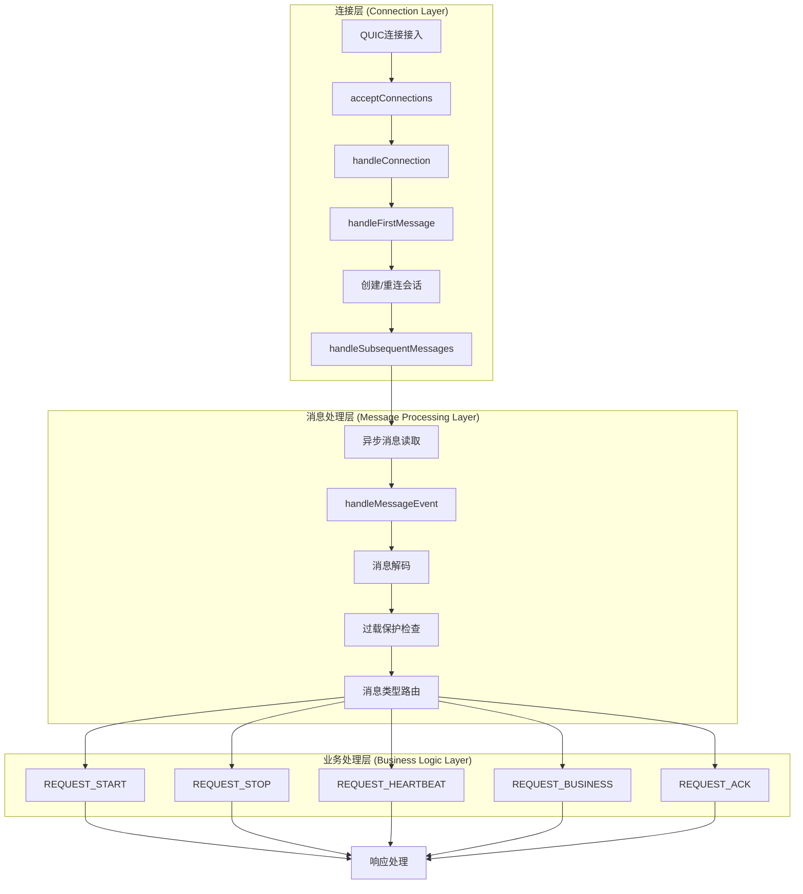

# GateSvr 客户端消息处理机制详细设计

## 1. 概述 (Overview)

GateSvr 网关系统支持5种不同类型的客户端消息包，每种消息都有特定的处理流程和验证逻辑。本文档详细说明每种消息类型的处理机制、验证规则、错误处理和响应逻辑。

**支持的消息类型：**
- **REQUEST_START (1)**: 连接建立请求
- **REQUEST_STOP (2)**: 连接断开请求  
- **REQUEST_HEARTBEAT (3)**: 心跳请求
- **REQUEST_BUSINESS (4)**: 业务请求
- **REQUEST_ACK (5)**: ACK确认消息

## 2. 消息处理总体流程

### 2.1 连接处理架构



### 2.2 消息处理核心流程 (internal/gateway/server_connection.go:105-151)

```go
func (s *Server) handleMessageEvent(ctx context.Context, session *session.Session, event MessageEvent) {
    // 1. 更新会话活跃状态
    session.UpdateActivity()
    s.metrics.IncQPS()
    s.performanceTracker.RecordRequest()
    
    // 2. 消息解码
    clientReq, err := s.messageCodec.DecodeClientRequest(event.Data)
    if err != nil {
        s.metrics.IncError("decode_error")
        return
    }
    
    // 3. 过载保护检查（心跳和ACK消息除外）
    if clientReq.Type != pb.RequestType_REQUEST_HEARTBEAT &&
       clientReq.Type != pb.RequestType_REQUEST_ACK {
        if !s.overloadProtector.AllowNewRequest() {
            s.sendOverloadErrorResponse(session, clientReq)
            return
        }
    }
    
    // 4. 消息类型路由处理
    var success bool
    switch clientReq.Type {
    case pb.RequestType_REQUEST_START:
        success = s.handleStartSync(session, clientReq)
    case pb.RequestType_REQUEST_STOP:
        success = s.handleStop(session, clientReq)
    case pb.RequestType_REQUEST_HEARTBEAT:
        success = s.handleHeartbeat(session, clientReq)
    case pb.RequestType_REQUEST_BUSINESS:
        success = s.handleBusinessRequest(ctx, session, clientReq)
    case pb.RequestType_REQUEST_ACK:
        success = s.handleAck(session, clientReq)
    default:
        s.metrics.IncError("unknown_message_type")
        success = false
    }
}
```

## 3. REQUEST_START (连接建立请求) 详细处理

### 3.1 消息特征与用途

**消息类型**: `REQUEST_START (1)`
**用途**: 建立客户端与服务器的会话连接，支持新连接和重连
**序列号要求**: `seq_id = 0` (连接级消息，不参与业务序列号)
**处理方式**: 同步处理，必须立即响应

### 3.2 消息结构

```protobuf
message StartRequest {
  string openid = 1;           // 用户唯一标识
  string client_id = 2;        // 客户端标识  
  string auth_token = 3;       // 认证令牌
  uint64 last_acked_seq_id = 4; // 重连时：最后确认的服务器序列号
  string app_version = 5;      // 应用版本
  string device_info = 6;      // 设备信息
}
```

### 3.3 处理流程图

```mermaid
sequenceDiagram
    participant C as 客户端
    participant G as GateSvr
    participant S as SessionManager
    participant V as 验证器
    
    C->>+G: StartRequest(OpenID, LastAckedSeqId)
    G->>G: 验证消息格式
    
    Note over G: 序列号验证
    alt seq_id != 0
        G-->>C: 错误响应(400, "序列号必须为0")
        G-->>-C: 处理结束
    end
    
    G->>G: 解码StartRequest
    
    Note over G: OpenID验证
    alt OpenID为空
        G-->>C: 错误响应(400, "OpenID不能为空")  
        G-->>-C: 处理结束
    end
    
    G->>+S: BindSession(session, OpenID)
    
    Note over S: OpenID绑定检查
    alt OpenID已被其他会话占用
        S-->>-G: 绑定失败
        G-->>C: 错误响应(500, "会话绑定失败")
        G-->>-C: 处理结束
    end
    
    S-->>-G: 绑定成功
    
    Note over G: 重连处理
    alt LastAckedSeqId > 0
        G->>S: AckMessagesUpTo(lastAckedSeqId)
        G->>G: ResyncSessionSequence()
        Note over G: 清理已确认历史消息
    end
    
    G->>+V: SendStartResponse(success=true)
    V-->>-G: 响应已发送
    G-->>-C: StartResponse(Success, ConnectionID, HeartbeatInterval)
    
    Note over C,G: 连接建立成功，开始正常通信
```

### 3.4 处理实现 (internal/gateway/handlers.go:247-296)

```go
func (s *Server) handleStartSync(sess *session.Session, req *pb.ClientRequest) bool {
    // 1. 序列号验证
    if req.SeqId != 0 {
        log.Printf("START消息序列号应为0 - 会话: %s, 实际序列号: %d", sess.ID, req.SeqId)
        s.sendErrorResponse(sess, req.MsgId, 400, "无效的序列号", "START消息序列号必须为0")
        return false
    }
    
    // 2. 消息解码
    startReq := &pb.StartRequest{}
    if err := proto.Unmarshal(req.Payload, startReq); err != nil {
        log.Printf("解析连接建立请求失败: %v", err)
        s.sendErrorResponse(sess, req.MsgId, 400, "解析请求失败", err.Error())
        return false
    }
    
    // 3. OpenID验证
    if startReq.Openid == "" {
        log.Printf("连接建立请求缺少OpenID - 会话: %s", sess.ID)
        s.sendErrorResponse(sess, req.MsgId, 400, "缺少OpenID", "OpenID不能为空")
        return false
    }
    
    // 4. 绑定会话到OpenID
    sess.OpenID = startReq.Openid
    sess.ClientID = req.Openid
    
    if err := s.sessionManager.BindSession(sess); err != nil {
        log.Printf("绑定session到openid失败: %v", err)
        s.sendErrorResponse(sess, req.MsgId, 500, "会话绑定失败", err.Error())
        return false
    }
    
    // 5. 重连处理：清理已确认消息
    if startReq.LastAckedSeqId > 0 {
        ackedCount := s.sessionManager.AckMessagesUpTo(sess.ID, startReq.LastAckedSeqId)
        s.orderedSender.ResyncSessionSequence(sess, startReq.LastAckedSeqId)
        
        log.Printf("重连时清除已确认消息 - 会话: %s, 最后确认序列号: %d, 清除数量: %d",
            sess.ID, startReq.LastAckedSeqId, ackedCount)
    }
    
    // 6. 发送成功响应
    connectionID := sess.ID
    if err := s.orderedSender.SendStartResponse(sess, req.MsgId, true, nil, 30, connectionID); err != nil {
        log.Printf("发送连接建立响应失败: %v", err)
        return false
    }
    
    log.Printf("同步处理连接建立请求成功 - OpenID: %s, 客户端: %s, 会话: %s, 状态: %d",
        startReq.Openid, sess.ClientID, sess.ID, sess.State())
    
    return true
}
```

### 3.5 响应消息结构

```protobuf
message StartResponse {
  bool success = 1;            // 连接是否成功
  repeated string error_msgs = 2; // 错误信息列表
  uint32 heartbeat_interval = 3; // 心跳间隔(秒)
  string connection_id = 4;    // 连接标识符
  string server_version = 5;   // 服务器版本
  uint64 server_timestamp = 6; // 服务器时间戳
}
```

### 3.6 错误场景处理

| 错误场景 | 错误码 | 错误消息 | 处理方式 |
|----------|--------|----------|----------|
| 序列号非0 | 400 | "序列号必须为0" | 拒绝请求，返回错误 |
| 消息解析失败 | 400 | "解析请求失败" | 拒绝请求，记录错误 |
| OpenID为空 | 400 | "OpenID不能为空" | 拒绝请求，要求重新发送 |
| 会话绑定冲突 | 500 | "会话绑定失败" | 拒绝请求，检查会话状态 |
| 响应发送失败 | - | 内部错误 | 记录日志，关闭连接 |

## 4. REQUEST_HEARTBEAT (心跳请求) 详细处理

### 4.1 消息特征与用途

**消息类型**: `REQUEST_HEARTBEAT (3)`
**用途**: 保持连接活跃，检测网络连通性
**序列号要求**: `seq_id = 0` (连接级消息)
**处理方式**: 同步快速响应，不受过载保护限制
**频率**: 客户端每30秒发送一次

### 4.2 消息结构

```protobuf
message HeartbeatRequest {
  uint64 client_timestamp = 1; // 客户端时间戳
  string client_version = 2;   // 客户端版本
  uint32 client_seq = 3;       // 客户端序列号(可选)
}
```

### 4.3 处理流程 (internal/gateway/handlers.go:18-39)

```go
func (s *Server) handleHeartbeat(sess *session.Session, req *pb.ClientRequest) bool {
    // 1. 序列号验证
    if req.SeqId != 0 {
        log.Printf("心跳消息序列号应为0 - 会话: %s, 实际序列号: %d", sess.ID, req.SeqId)
        return false
    }
    
    // 2. 解码心跳请求
    heartbeatReq := &pb.HeartbeatRequest{}
    if err := proto.Unmarshal(req.Payload, heartbeatReq); err != nil {
        log.Printf("解析心跳请求失败: %v", err)
        return false
    }
    
    // 3. 发送心跳响应（包含往返时间计算）
    if err := s.orderedSender.SendHeartbeatResponse(sess, req.MsgId, heartbeatReq.ClientTimestamp); err != nil {
        log.Printf("发送心跳响应失败: %v", err)
        return false
    }
    
    log.Printf("处理心跳请求 - 客户端: %s, 会话: %s", sess.ClientID, sess.ID)
    return true
}
```

### 4.4 响应消息结构

```protobuf
message HeartbeatResponse {
  uint64 server_timestamp = 1;  // 服务器时间戳
  uint64 client_timestamp = 2;  // 回显客户端时间戳
  uint32 active_sessions = 3;    // 活跃会话数
  string server_load = 4;        // 服务器负载信息
}
```

### 4.5 心跳特殊处理

**不受过载保护限制**: 心跳消息绕过过载保护检查，确保连接检测的及时性
**快速响应**: 心跳处理优先级最高，延迟通常 < 5ms
**连接维护**: 成功的心跳会更新会话的 `LastActivity` 时间，防止会话超时

## 5. REQUEST_BUSINESS (业务请求) 详细处理

### 5.1 消息特征与用途

**消息类型**: `REQUEST_BUSINESS (4)`
**用途**: 处理所有业务逻辑请求，包括登录、业务操作等
**序列号要求**: `seq_id > 0` 且严格递增
**处理方式**: 支持同步/异步处理，Hello请求强制同步

### 5.2 消息结构

```protobuf
message BusinessRequest {
  string action = 1;                    // 业务动作名称
  map<string, string> params = 2;      // 请求参数
  bytes data = 3;                       // 业务数据
  map<string, string> metadata = 4;    // 元数据
  uint64 timeout_ms = 5;               // 超时时间(毫秒)
}
```

### 5.3 处理流程图

```mermaid
flowchart TD
    A[接收BusinessRequest] --> B[验证序列号]
    B --> C{序列号是否连续递增?}
    C -->|否| D[返回序列号错误]
    C -->|是| E[解析BusinessRequest]
    
    E --> F{Action是否为"hello"?}
    F -->|是| G[登录请求处理]
    F -->|否| H{会话是否已登录?}
    
    G --> I[验证会话状态]
    H -->|否| J[返回未登录错误]
    H -->|是| K[过载保护检查]
    
    I --> K
    K -->|拒绝| L[返回过载错误]
    K -->|通过| M[确定上游服务类型]
    
    M --> N[创建上游请求]
    N --> O{是否为Hello请求?}
    
    O -->|是| P[同步处理]
    O -->|否| Q{异步处理器可用?}
    
    Q -->|否| P
    Q -->|是| R[异步处理]
    
    P --> S[调用上游服务]
    R --> T[提交异步任务]
    
    S --> U{上游调用成功?}
    U -->|否| V[返回上游错误]
    U -->|是| W{是否为Hello成功?}
    
    W -->|是| X[激活会话]
    W -->|否| Y[发送业务响应]
    X --> Y
    
    Y --> Z[处理绑定notify]
    T --> AA[异步队列处理]
    AA --> S
    
    Z --> BB[处理完成]
```

### 5.4 序列号验证机制

```go
func (s *Server) validateBusinessSequence(sess *session.Session, req *pb.ClientRequest) bool {
    if !s.sessionManager.ValidateClientSequence(sess.ID, req.SeqId) {
        expectedSeq := s.sessionManager.GetExpectedClientSequence(sess.ID)
        log.Printf("业务消息序列号验证失败 - 会话: %s, 实际序列号: %d, 期待序列号: %d",
            sess.ID, req.SeqId, expectedSeq)
        s.sendErrorResponse(sess, req.MsgId, 400, "无效的序列号",
            fmt.Sprintf("序列号必须递增且连续，期待: %d, 实际: %d", expectedSeq, req.SeqId))
        return false
    }
    return true
}
```

### 5.5 登录请求特殊处理

**Hello Action识别**:
```go
isLoginAction := strings.ToLower(businessReq.Action) == "hello"
```

**登录状态验证**:
```go
if isLoginAction {
    // 登录请求：必须在Inited或Normal状态
    if !sess.CanProcessLoginRequest() {
        s.sendErrorResponse(sess, req.MsgId, 403, "会话状态错误", "当前状态不允许登录")
        return false
    }
} else {
    // 非登录请求：必须在Normal状态（已登录）
    if !sess.CanProcessBusinessRequest() {
        s.sendErrorResponse(sess, req.MsgId, 401, "未登录", "请先登录")
        return false
    }
}
```

### 5.6 上游服务路由

**服务类型决策**:
```go
func (s *Server) determineUpstreamService(businessReq *pb.BusinessRequest) upstream.ServiceType {
    action := strings.ToLower(businessReq.Action)
    
    // Hello服务：处理登录、认证相关请求
    if isHelloAction(action) {
        return upstream.ServiceTypeHello
    }
    
    // Zone服务：处理区域功能相关请求  
    if isZoneAction(action) {
        return upstream.ServiceTypeZone
    }
    
    // 默认使用Business服务
    return upstream.ServiceTypeBusiness
}
```

**Action分类规则**:
- **Hello服务**: hello, logout, status, heartbeat, data_sync
- **Zone服务**: zone, echo, calculate, time  
- **Business服务**: 其他所有业务请求

### 5.7 异步处理机制

**异步任务结构**:
```go
type AsyncTask struct {
    TaskID      string                // 任务唯一标识
    SessionID   string                // 会话ID
    Session     *session.Session      // 会话对象
    Request     *pb.ClientRequest     // 原始请求
    BusinessReq *pb.BusinessRequest   // 业务请求
    ServiceType upstream.ServiceType  // 上游服务类型
    UpstreamReq *pb.UpstreamRequest   // 上游请求
    Context     context.Context       // 执行上下文
    IsLogin     bool                  // 是否为登录请求
}
```

**异步处理优势**:
- **非阻塞**: 请求立即返回，不等待上游响应
- **并发处理**: 多工作协程并行处理任务
- **资源隔离**: 独立协程池，不影响主处理流程
- **过载保护**: 队列满时拒绝新任务

### 5.8 会话激活处理

**登录成功后的处理**:
```go
func (s *Server) handleLoginSuccess(sess *session.Session, upstreamResp *pb.UpstreamResponse) error {
    var zone int64
    var err error
    
    // 从响应头中解析Zone信息
    if zoneStr, exists := upstreamResp.Headers["zone"]; exists && zoneStr != "" {
        zone, err = strconv.ParseInt(zoneStr, 10, 64)
        if err != nil {
            return fmt.Errorf("解析Zone失败: %v", err)
        }
    }
    
    // 激活会话到指定Zone
    if err := s.sessionManager.ActivateSession(sess.ID, zone); err != nil {
        return fmt.Errorf("激活会话失败: %v", err)
    }
    
    log.Printf("登录成功，会话已激活 - 会话: %s, Zone: %d", sess.ID, zone)
    return nil
}
```

## 6. REQUEST_ACK (ACK确认消息) 详细处理

### 6.1 消息特征与用途

**消息类型**: `REQUEST_ACK (5)`
**用途**: 确认收到服务器推送消息，清理已确认消息队列
**序列号要求**: `seq_id = 0` (确认级消息)
**处理方式**: 同步快速处理，不受过载保护限制

### 6.2 消息结构

```protobuf
message ClientAck {
  uint64 acked_seq_id = 1;     // 确认的服务器序列号
  repeated uint64 nack_seq_ids = 2; // 明确拒绝的序列号(可选)
  string ack_reason = 3;       // 确认原因(可选)
}
```

### 6.3 处理实现 (internal/gateway/handlers.go:213-237)

```go
func (s *Server) handleAck(sess *session.Session, req *pb.ClientRequest) bool {
    // 1. 序列号验证
    if req.SeqId != 0 {
        log.Printf("ACK消息序列号应为0 - 会话: %s, 实际序列号: %d", sess.ID, req.SeqId)
        return false
    }
    
    // 2. 解码ACK消息
    ack := &pb.ClientAck{}
    if err := proto.Unmarshal(req.Payload, ack); err != nil {
        log.Printf("解析ACK消息失败: %v", err)
        return false
    }
    
    // 3. 批量确认消息
    ackedCount := s.sessionManager.AckMessagesUpTo(sess.ID, ack.AckedSeqId)
    
    // 4. 重同步发送器序列号状态
    s.orderedSender.ResyncSessionSequence(sess, ack.AckedSeqId)
    
    // 5. 更新监控指标
    s.metrics.SetOutboundQueueSize(sess.ID, s.sessionManager.GetPendingCount(sess.ID))
    
    if ackedCount > 0 {
        log.Printf("收到ACK确认 - 序列号: %d, 会话: %s, 清除消息数: %d", 
            ack.AckedSeqId, sess.ID, ackedCount)
        return true
    } else {
        log.Printf("ACK确认无效 - 序列号: %d, 会话: %s", ack.AckedSeqId, sess.ID)
        return false
    }
}
```

### 6.4 批量确认机制

**批量ACK优势**:
- **效率提升**: 一次确认多个消息，减少网络开销
- **内存释放**: 及时清理已确认消息，防止内存积压
- **性能优化**: 批量操作比逐个确认效率更高

**确认处理流程**:
1. **解析ACK序列号**: 提取客户端确认的最大序列号
2. **批量清理**: 删除序列号 ≤ acked_seq_id 的所有消息
3. **状态更新**: 更新会话和队列的确认状态
4. **监控更新**: 更新队列大小等监控指标

### 6.5 ACK超时和重传机制

**重传触发条件**:
- ACK超时：30秒未收到确认
- 最大重试：3次重传
- 重传间隔：递增退避 (1s, 2s, 4s)

**重传处理**:
```go
// 有序队列中的重传逻辑
func (q *OrderedMessageQueue) retryTimedOutMessages() {
    for seq, msg := range q.sentMessages {
        if time.Since(msg.SentTime) > q.ackTimeout && msg.RetryCount < q.maxRetries {
            // 重传消息
            if err := q.sendCallback(msg); err == nil {
                msg.RetryCount++
                msg.SentTime = time.Now()
            }
        }
    }
}
```

## 7. REQUEST_STOP (连接断开请求) 详细处理

### 7.1 消息特征与用途

**消息类型**: `REQUEST_STOP (2)`
**用途**: 客户端主动断开连接，清理服务器端会话
**序列号要求**: `seq_id = 0` (连接级消息)
**处理方式**: 同步处理，立即清理资源

### 7.2 消息结构

```protobuf
message StopRequest {
  StopReason reason = 1;       // 断开原因
  string message = 2;          // 自定义消息
  bool save_session = 3;       // 是否保存会话数据
  uint32 delay_seconds = 4;    // 延迟清理时间
}

enum StopReason {
  STOP_UNKNOWN = 0;           // 未知原因
  USER_LOGOUT = 1;            // 用户登出
  APP_CLOSE = 2;              // 应用关闭
  SWITCH_ACCOUNT = 3;         // 切换账户
  NETWORK_ERROR = 4;          // 网络错误
}
```

### 7.3 处理实现 (internal/gateway/handlers.go:299-327)

```go
func (s *Server) handleStop(sess *session.Session, req *pb.ClientRequest) bool {
    stopReq := &pb.StopRequest{}
    if err := proto.Unmarshal(req.Payload, stopReq); err != nil {
        log.Printf("解析连接断开请求失败: %v", err)
        return false
    }
    
    // 映射断开原因
    reason := "client_requested"
    switch stopReq.Reason {
    case pb.StopRequest_USER_LOGOUT:
        reason = "user_logout"
    case pb.StopRequest_APP_CLOSE:
        reason = "app_close"  
    case pb.StopRequest_SWITCH_ACCOUNT:
        reason = "switch_account"
    default:
        reason = "unknown"
    }
    
    log.Printf("收到连接断开请求 - 客户端: %s, 会话: %s, 原因: %s",
        sess.ClientID, sess.ID, reason)
    
    // 根据断开原因决定清理策略
    delayCleanup := stopReq.Reason == pb.StopRequest_SWITCH_ACCOUNT
    s.sessionManager.RemoveSessionWithDelay(sess.ID, delayCleanup, reason)
    
    log.Printf("处理连接断开请求完成 - 会话: %s, 原因: %s", sess.ID, reason)
    
    return false  // 返回false表示连接应该关闭
}
```

### 7.4 断开原因处理策略

| 断开原因 | 清理策略 | 重连支持 | 会话保留时间 |
|----------|----------|----------|--------------|
| USER_LOGOUT | 立即清理 | 不支持 | 0秒 |
| APP_CLOSE | 延迟清理 | 支持 | 30秒 |
| SWITCH_ACCOUNT | 延迟清理 | 支持 | 30秒 |
| NETWORK_ERROR | 延迟清理 | 支持 | 30秒 |
| UNKNOWN | 立即清理 | 不支持 | 0秒 |

## 8. 错误处理机制

### 8.1 统一错误响应

**错误响应格式**:
```go
func (s *Server) sendErrorResponse(sess *session.Session, msgID uint32, code int32, message, detail string) {
    if err := s.orderedSender.SendErrorResponse(sess, msgID, code, message, detail); err != nil {
        log.Printf("发送错误响应失败: %v", err)
    }
}
```

### 8.2 常见错误码定义

| 错误码 | 错误类型 | 描述 | 处理建议 |
|--------|----------|------|----------|
| 400 | 客户端错误 | 消息格式错误、参数错误 | 检查消息格式和参数 |
| 401 | 认证错误 | 未登录或认证失败 | 重新登录认证 |
| 403 | 权限错误 | 会话状态不正确 | 检查会话状态 |
| 500 | 服务器错误 | 内部处理错误 | 重试或联系技术支持 |
| 503 | 服务繁忙 | 过载保护触发 | 降低请求频率，稍后重试 |

### 8.3 过载保护错误响应

```go
func (s *Server) sendOverloadErrorResponse(session *session.Session, req *pb.ClientRequest) {
    switch req.Type {
    case pb.RequestType_REQUEST_START:
        s.orderedSender.SendStartResponse(session, req.MsgId, false, nil, 0, "")
    case pb.RequestType_REQUEST_BUSINESS:
        s.orderedSender.SendErrorResponse(session, req.MsgId, 503, "服务器过载", "请求过多，请稍后重试")
    default:
        s.orderedSender.SendErrorResponse(session, req.MsgId, 503, "服务器过载", "请求过多，请稍后重试")
    }
}
```

## 9. 性能监控与指标

### 9.1 关键性能指标

| 指标名称 | 类型 | 说明 |
|----------|------|------|
| message_processing_duration | Histogram | 消息处理耗时分布 |
| message_type_counter | Counter | 各类型消息计数 |
| error_rate_by_type | Counter | 按错误类型统计错误率 |
| active_session_count | Gauge | 活跃会话数量 |
| message_queue_size | Gauge | 消息队列大小 |
| upstream_request_duration | Histogram | 上游请求耗时 |

### 9.2 处理性能基准

| 消息类型 | 平均处理时间 | 99%分位耗时 | QPS容量 |
|----------|--------------|-------------|---------|
| HEARTBEAT | < 1ms | < 5ms | 10,000+ |
| ACK | < 2ms | < 10ms | 8,000+ |
| START | < 10ms | < 50ms | 1,000+ |
| BUSINESS (同步) | < 50ms | < 200ms | 2,000+ |
| BUSINESS (异步) | < 5ms | < 20ms | 5,000+ |
| STOP | < 5ms | < 20ms | 500+ |

## 10. 最佳实践建议

### 10.1 客户端开发建议

1. **序列号管理**: 严格维护业务消息的递增序列号
2. **心跳机制**: 定期发送心跳维持连接活跃
3. **ACK确认**: 及时确认收到的服务器消息，使用批量确认提升效率
4. **错误重试**: 实现指数退避重试机制
5. **重连处理**: 断线重连时正确上报 LastAckedSeqId

### 10.2 服务端配置优化

1. **过载保护**: 根据服务器性能调整过载保护阈值
2. **异步处理**: 为非登录业务请求启用异步处理
3. **会话超时**: 合理设置会话超时时间平衡性能和用户体验  
4. **监控告警**: 配置关键指标的监控和告警
5. **日志管理**: 合理设置日志级别，避免性能影响

---

*文档版本: v1.0*  
*最后更新: 2025-01-12*  
*维护者: GateSvr Team*