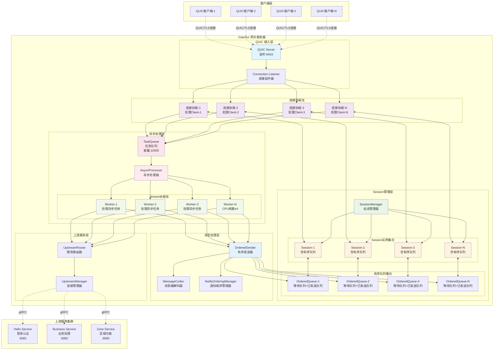
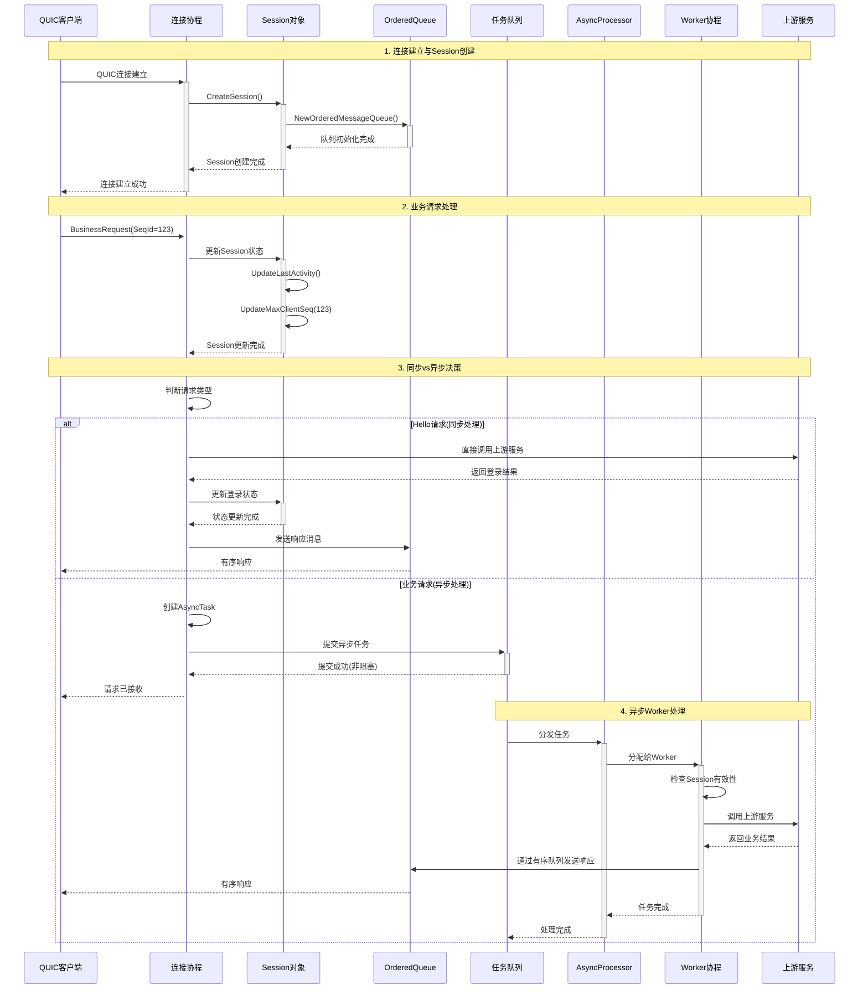
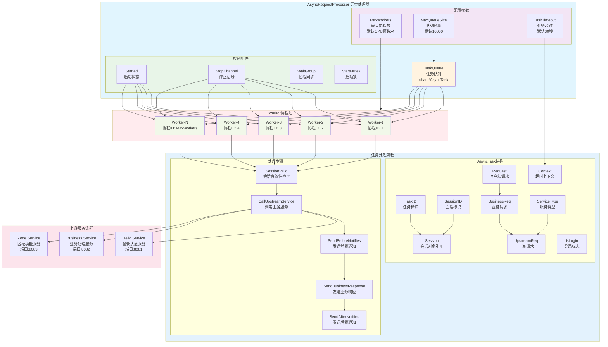
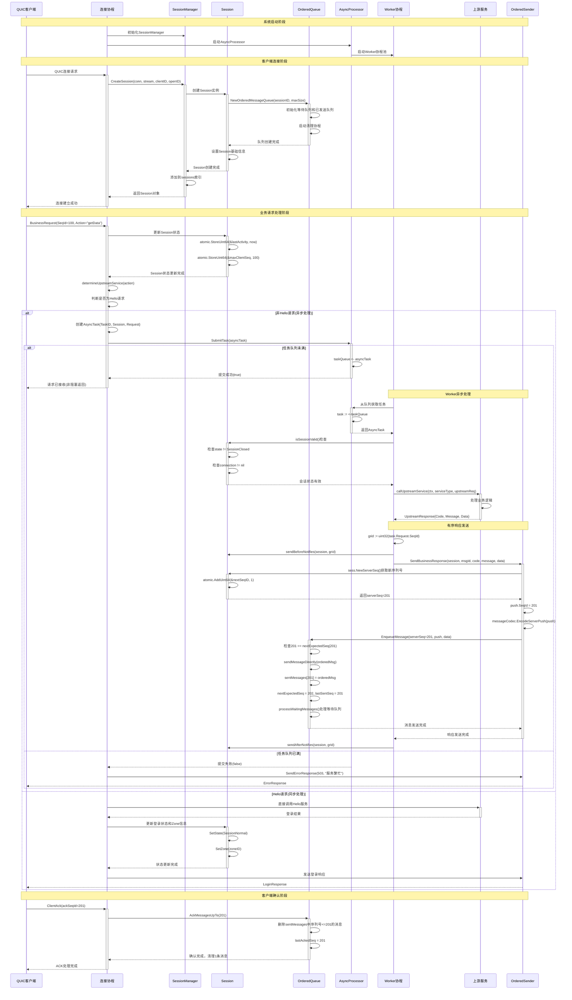

# GateSvr 整体架构框架图

基于对整个项目的深入分析，绘制包含Session管理、连接协程、异步处理协程池的完整架构框架图。

## 1. 系统整体架构图



## 2. 连接协程处理流程图



## 3. Session与有序队列详细结构图

```mermaid
graph TB
    subgraph SESSION["Session对象结构"]
        subgraph SESSION_BASIC["基础信息"]
            SID[SessionID<br/>会话唯一标识]
            CONN[QUIC Connection<br/>底层连接]
            STREAM[QUIC Stream<br/>双向流]
            STATE[SessionState<br/>Inited/Normal/Closed]
        end
        
        subgraph SESSION_CLIENT["客户端信息"]
            CID[ClientID<br/>客户端标识]
            OID[OpenID<br/>用户标识]
            ZONE[Zone<br/>分区信息]
            IP[UserIP<br/>客户端IP]
        end
        
        subgraph SESSION_SEQ["序列号管理"]
            NSS[NextServerSeq<br/>下个服务器序列号]
            MCS[MaxClientSeq<br/>最大客户端序列号]
            CAS[ClientAckServerSeq<br/>客户端确认序列号]
        end
        
        subgraph SESSION_TIME["时间管理"]
            CT[CreateTime<br/>创建时间]
            LA[LastActivity<br/>最后活跃时间]
        end
    end
    
    subgraph ORDERED_QUEUE["有序消息队列"]
        subgraph QUEUE_BASIC["队列基础"]
            QID[SessionID<br/>所属会话ID]
            MAX_SIZE[MaxQueueSize<br/>最大队列容量]
            CALLBACK[SendCallback<br/>发送回调函数]
        end
        
        subgraph WAITING_QUEUE["等待队列(最小堆)"]
            WQ[WaitingQueue<br/>MessageQueue]
            WQ_DESC[存储等待发送的消息<br/>按序列号排序<br/>处理序列号跳跃]
        end
        
        subgraph SENT_QUEUE["已发送队列(Map)"]
            SM[SentMessages<br/>map[uint64]*OrderedMessage]
            SM_DESC[存储已发送待确认消息<br/>支持重传和批量ACK<br/>客户端确认后清理]
        end
        
        subgraph QUEUE_SEQ["队列序列号"]
            NES[NextExpectedSeq<br/>下个期望序列号]
            LSS[LastSentSeq<br/>最后发送序列号]
            LAS[LastAckedSeq<br/>最后确认序列号]
        end
        
        subgraph QUEUE_CONTROL["队列控制"]
            STOPPED[Stopped<br/>停止标志]
            STOP_CH[StopChannel<br/>停止信号]
            CLEANUP[CleanupTicker<br/>清理定时器]
        end
    end
    
    subgraph NOTIFY_MANAGER["通知保序管理器"]
        subgraph BEFORE_NOTIFY["Response前通知"]
            BN[BeforeNotifies<br/>map[uint32][]*NotifyItem]
            BN_DESC[按客户端序列号绑定<br/>在业务响应前发送]
        end
        
        subgraph AFTER_NOTIFY["Response后通知"]
            AN[AfterNotifies<br/>map[uint32][]*NotifyItem]
            AN_DESC[按客户端序列号绑定<br/>在业务响应后发送]
        end
    end
    
    %% Session内部关系
    SID --> CONN
    CONN --> STREAM
    OID --> ZONE
    NSS --> MCS
    MCS --> CAS
    
    %% Session到队列
    SESSION --> ORDERED_QUEUE
    SID -.-> QID
    NSS -.-> NES
    
    %% 队列内部关系
    WQ --> WQ_DESC
    SM --> SM_DESC
    NES --> LSS
    LSS --> LAS
    CALLBACK --> SM
    CLEANUP --> SM
    
    %% Session到通知管理器
    SESSION --> NOTIFY_MANAGER
    MCS -.-> BN
    MCS -.-> AN
    
    %% 样式定义
    style SESSION fill:#e1f5fe
    style SESSION_BASIC fill:#f3e5f5
    style SESSION_CLIENT fill:#e8f5e8
    style SESSION_SEQ fill:#fff3e0
    style SESSION_TIME fill:#ffebee
    style ORDERED_QUEUE fill:#f1f8e9
    style WAITING_QUEUE fill:#e3f2fd
    style SENT_QUEUE fill:#fce4ec
    style NOTIFY_MANAGER fill:#f9fbe7
```

## 4. 异步处理协程池架构图



## 5. 系统核心交互流程图



## 6. 架构特点总结

### 6.1 核心设计特点

1. **一对一连接协程模式**
   - 每个QUIC客户端对应一个专用的连接协程
   - 连接协程负责该客户端的所有消息接收和Session维护
   - 避免多连接间的竞争和锁冲突

2. **Session与有序队列绑定**
   - 每个Session包含一个独立的OrderedMessageQueue
   - 队列保证该Session内消息的严格有序性
   - 支持消息重传、批量ACK和超时清理

3. **异步处理协程池**
   - 连接协程快速处理Session更新后立即返回
   - 耗时的上游服务调用交给Worker协程池异步处理
   - 协程池大小可配置，默认CPU核数x4

4. **分层解耦架构**
   - 连接层：处理QUIC连接和基础协议
   - Session层：管理会话状态和消息队列
   - 异步层：处理业务逻辑和上游调用
   - 消息层：保证消息有序性和可靠传输

### 6.2 性能优势

- ✅ **高并发支持**: 连接协程非阻塞，支持大量并发连接
- ✅ **消息保序**: 每Session独立队列确保消息严格有序
- ✅ **弹性处理**: 异步协程池支持动态负载调整
- ✅ **容错能力**: 多层检查和重传机制保证可靠性
- ✅ **内存高效**: 基于堆的等待队列和Map的已发送队列
- ✅ **监控完善**: 完整的统计信息和性能指标

这种架构设计有效解决了高并发网关服务中的性能瓶颈和可靠性问题，实现了高吞吐量、低延迟的消息处理能力。