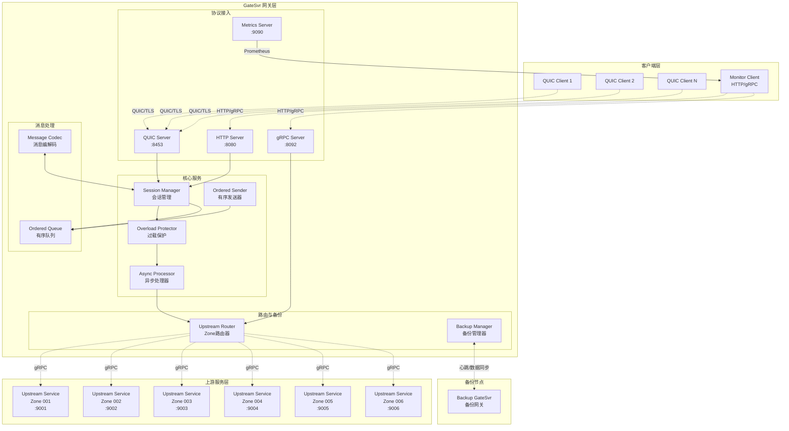
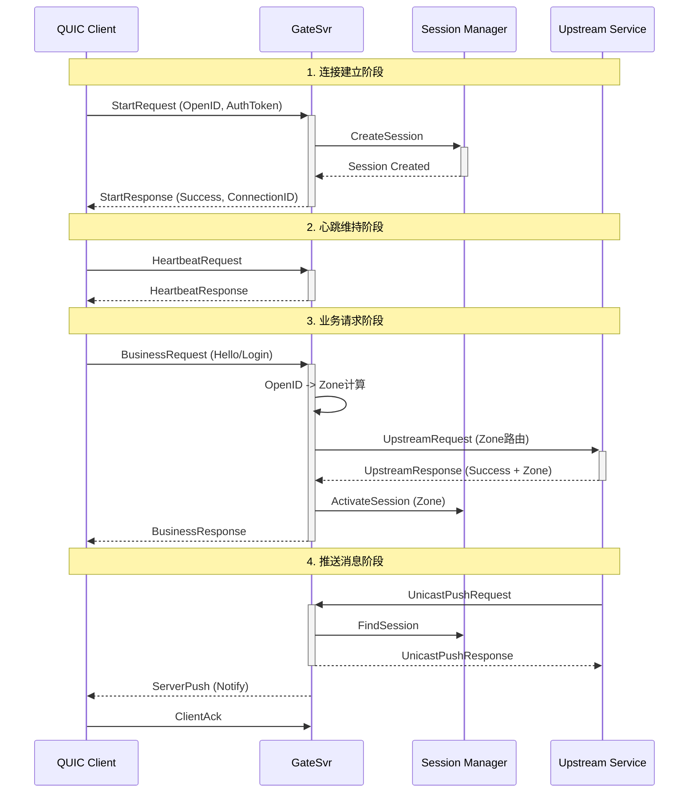

# GateSvr 技术设计文档

## 1. 摘要 (Executive Summary)

GateSvr 是一个基于 QUIC 协议的高性能网关服务器，专为大规模实时通信系统设计。项目采用 Go 语言开发，提供了完整的 session 管理、请求分发、消息推送和广播功能，支持双向消息时序保证和消息可靠性设计。

**核心功能特性：**
- **协议支持**: QUIC、HTTP、gRPC 多协议同时支持
- **消息可靠性**: 完整的 ACK 机制和有序消息队列
- **notify和respoense保序**:
- **协程池异步调用上游服务**:
- **过载保护**: 过载保护机制

**技术栈：**
- **运行时**: Go 1.24+
- **传输协议**: QUIC-GO, gRPC
- **消息序列化**: Protocol Buffers
- **容器化**: Docker

## 2. 技术栈与依赖 (Tech Stack & Dependencies)

### 2.1 核心技术栈

| 技术 | 版本 | 用途 | 说明 |
|------|------|------|------|
| Go | 1.23+ | 运行时 | 主要开发语言 |
| QUIC-GO | v0.54.0 | 传输协议 | 提供低延迟可靠连接 |
| gRPC | v1.74.2 | 服务通信 | 上游服务调用 |
| Protocol Buffers | v1.36.6 | 消息序列化 | 高效的消息编解码 |
| Prometheus | v1.19.1 | 监控指标 | 系统监控和指标收集 |
| YAML | v3.0.1 | 配置管理 | 配置文件解析 |
| UUID | v1.6.0 | 会话标识 | 会话ID生成 |

### 2.2 架构选型说明

- **QUIC 协议**: 选择 QUIC 而非传统 TCP 的原因是其内置的多路复用、快速握手和网络切换支持
- **gRPC**: 用于与上游服务通信，提供类型安全和高性能的 RPC 调用
- **Protocol Buffers**: 提供跨语言、高效的消息序列化方案

## 3. 系统架构 (System Architecture)

### 3.1 整体架构设计(有问题)



### 3.2 数据流设计

#### 3.2.1 客户端请求处理流程



#### 3.2.2 Zone 路由算法(todo不需要这么详细)

Zone路由核心算法实现：

```go
// internal/upstream/zone.go:15-31
func GetZoneByOpenID(openID string) (string, error) {
    // 1. MD5哈希OpenID
    hash := md5.Sum([]byte(openID))
    
    // 2. 取前4字节转整数
    hashInt := uint32(hash[0])<<24 + uint32(hash[1])<<16 + 
              uint32(hash[2])<<8 + uint32(hash[3])
    
    // 3. 模6取余映射到Zone 001-006
    zoneNum := (hashInt % 6) + 1
    return fmt.Sprintf("%03d", zoneNum), nil
}
```

**路由分配策略：**
- OpenID 通过 MD5 哈希确保分布均匀性
- 6个Zone (001-006) 平均承担负载
- 相同 OpenID 始终路由到相同 Zone
- 支持 Zone 服务动态注册和注销

## 4. 数据模型设计 (Data Model Design)

### 4.1 会话模型 (Session Model)

| 字段名 | 类型 | 说明 | 备注 |
|--------|------|------|------|
| ID | string | 会话唯一标识 | UUID格式 |
| Connection | *quic.Conn | QUIC连接对象 | 底层传输连接 |
| Stream | *quic.Stream | 双向流 | 消息收发通道 |
| CreateTime | time.Time | 创建时间 | 会话建立时间 |
| LastActivity | time.Time | 最后活跃时间 | 用于超时检测 |
| ClientID | string | 客户端标识 | 客户端唯一ID |
| OpenID | string | 用户标识 | 业务层用户ID |
| UserIP | string | 客户端IP | 用于日志和安全 |
| state | int32 | 会话状态 | Inited/Normal/Closed |
| zone | int64 | 分区标识 | Zone 001-006 |
| nextSeqID | uint64 | 下个序列号 | 服务端消息序列 |
| maxClientSeq | uint64 | 最大客户端序列号 | 客户端消息序列 |

**会话状态转换：**
```
Inited (初始化) -> Normal (正常) -> Closed (关闭)
     |              |                |
     |              |                |
   登录成功      会话超时/客户端断开    清理资源
```

### 4.2 消息协议模型

#### 4.2.1 客户端请求消息
```protobuf
message ClientRequest {
  uint32 msg_id = 1;           // 消息ID
  uint64 seq_id = 2;           // 序列号
  RequestType type = 3;        // 请求类型
  bytes payload = 4;           // 消息载荷
  map<string, string> headers = 5; // 扩展头部
  string openid = 6;           // 客户端标识
}
```

#### 4.2.2 服务端推送消息
```protobuf
message ServerPush {
  uint32 msg_id = 1;           // 消息ID
  uint64 seq_id = 2;           // 序列号
  PushType type = 3;           // 推送类型
  bytes payload = 4;           // 消息载荷
  map<string, string> headers = 5; // 扩展头部
}
```

#### 4.2.3 请求类型枚举
| 类型 | 值 | 说明 | 序列号要求 |
|------|-----|------|------------|
| REQUEST_START | 1 | 连接建立 | seq_id = 0 |
| REQUEST_STOP | 2 | 连接断开 | seq_id = 0 |
| REQUEST_HEARTBEAT | 3 | 心跳请求 | seq_id = 0 |
| REQUEST_BUSINESS | 4 | 业务请求 | seq_id > 0, 递增 |
| REQUEST_ACK | 5 | 确认消息 | seq_id = 0 |

### 4.3 上游服务模型

| 字段名 | 类型 | 说明 |
|--------|------|------|
| Address | string | 服务地址 "ip:port" |
| ZoneID | string | Zone标识 "001"-"006" |
| Client | pb.UpstreamServiceClient | gRPC客户端 |
| LastSeen | time.Time | 最后活跃时间 |
| IsHealthy | bool | 健康状态 |

**Zone分配示例：**
```yaml
# Zone 001: ./upstream --zone=001 --addr=localhost:9001 --gateway=localhost:8092
# Zone 002: ./upstream --zone=002 --addr=localhost:9002 --gateway=localhost:8092
# Zone 003: ./upstream --zone=003 --addr=localhost:9003 --gateway=localhost:8092
# Zone 004: ./upstream --zone=004 --addr=localhost:9004 --gateway=localhost:8092
# Zone 005: ./upstream --zone=005 --addr=localhost:9005 --gateway=localhost:8092
# Zone 006: ./upstream --zone=006 --addr=localhost:9006 --gateway=localhost:8092
```

## 5. 核心模块分析 (Core Module Analysis)

### 5.1 会话管理器 (Session Manager)

**文件位置**: `internal/session/manager.go`

**功能职责：**
- 会话生命周期管理 (创建、重连、清理)
- 会话状态维护 (Inited -> Normal -> Closed)
- 消息序列号验证和管理
- 会话超时检测和清理

**核心特性：**
```go
// 会话创建或重连逻辑 (internal/session/manager.go:47-113)
func (m *Manager) CreateOrReconnectSession(conn *quic.Conn, stream *quic.Stream, 
    clientID, openID, userIP string) (*Session, bool) {
    
    // 1. 检查是否可重连
    if openID != "" {
        if existingSession := m.findExistingSession(openID); existingSession != nil {
            if time.Since(existingSession.LastActivity) < m.connectionDownDelay*2 {
                return m.handleReconnection(existingSession, conn, stream)
            }
        }
    }
    
    // 2. 创建新会话
    session := m.createNewSession(conn, stream, clientID, openID, userIP)
    return session, false
}
```

**重连机制：**
- 30秒内支持无缝重连
- 保持原有消息队列和序列号
- 旧连接延迟5秒关闭，确保消息传输完成

### 5.2 Zone 路由器 (Upstream Router)

**文件位置**: `internal/upstream/manager.go`

**功能职责：**
- 基于 OpenID 的一致性哈希路由
- 上游服务注册和健康检查
- gRPC 连接池管理
- 负载均衡和故障转移

**路由实现：**
```go
// 根据OpenID路由到上游服务 (internal/upstream/manager.go:60-87)
func (r *OpenIDBasedRouter) RouteByOpenID(ctx context.Context, openID string, 
    req *pb.UpstreamRequest) (*pb.UpstreamResponse, error) {
    
    // 1. 根据OpenID计算ZoneID
    zoneID, err := GetZoneByOpenID(openID)
    
    // 2. 获取该大区的上游服务实例
    instance, err := r.zoneServices.GetInstanceByZone(zoneID)
    
    // 3. 更新服务实例活跃时间
    r.zoneServices.UpdateInstanceLastSeen(zoneID)
    
    // 4. 调用上游服务
    response, err := instance.Client.ProcessRequest(ctx, req)
    return response, nil
}
```

**服务注册：**
- 动态服务发现和注册
- gRPC健康检查
- 连接池复用优化

### 5.3 有序消息队列 (Ordered Queue)

**文件位置**: `internal/session/ordered_queue.go`

**功能职责：**
- 消息顺序保证
- ACK机制支持
- 消息重传处理
- 批量确认优化

**设计特点：**
- 每个会话独立的消息队列
- 支持批量ACK提升性能
- 消息超时重传机制
- 内存友好的滑动窗口设计

**批量ACK实现：**
```go
// 批量确认消息 (internal/session/manager.go:232-249)
func (m *Manager) AckMessagesUpTo(sessionID string, ackSeqID uint64) int {
    session, exists := m.GetSession(sessionID)
    if !exists {
        return 0
    }
    
    // 更新会话的ACK序列号
    session.UpdateAckServerSeq(ackSeqID)
    
    // 使用OrderedMessageQueue的批量确认功能
    orderedQueue := session.GetOrderedQueue()
    return orderedQueue.AckMessagesUpTo(ackSeqID)
}
```

### 5.4 过载保护器 (Overload Protector)

**文件位置**: `internal/gateway/overload_protector.go`

**保护维度：**
- 连接数限制 (max_connections: 1000)
- QPS限制 (max_qps: 2000, 10s窗口)
- 上游并发限制 (max_upstream_concurrent: 100)
- 上游请求超时 (upstream_timeout: 30s)

**保护策略：**
```go
// 过载保护配置示例
type OverloadConfig struct {
    Enabled                      bool
    MaxConnections              int    // 1000
    ConnectionWarningThreshold   int    // 800
    MaxQPS                      int    // 2000
    QPSWarningThreshold         int    // 1600
    QPSWindowSeconds            int    // 10
    MaxUpstreamConcurrent       int    // 100
    UpstreamTimeout             time.Duration // 30s
    UpstreamWarningThreshold    int    // 80
}
```

**保护机制：**
- 多级预警机制 (Warning Threshold)
- 快速失败避免雪崩
- 实时指标监控
- 梯度限流策略

### 5.5 备份管理器 (Backup Manager)

**文件位置**: `internal/backup/backup_manager.go`

**高可用特性：**
- Primary/Backup 双节点模式
- 心跳检测 (2s间隔, 6s超时)
- 数据实时同步 (批量: 50, 超时: 200ms)
- 自动故障切换 (切换超时: 10s)

**备份配置：**
```yaml
backup:
  enabled: true
  mode: "primary"              # primary 或 backup
  server_id: "gate-001"
  heartbeat:
    interval: "2s"
    peer_addr: "backup-server:8093"
    timeout: "6s"
  sync:
    peer_addr: "backup-server:8094"
    batch_size: 50
    timeout: "200ms"
    buffer_size: 1000
```

**故障切换流程：**
1. 心跳监测发现主节点失联
2. 备份节点等待检测超时 (6s)
3. 执行故障切换 (10s超时)
4. 备份节点升级为主节点
5. 恢复服务处理能力

## 6. 部署与环境 (Deployment & Environment)

### 6.1 端口配置

| 服务 | 端口 | 协议 | 用途 |
|------|------|------|------|
| QUIC Server | 8453 | QUIC/TLS | 客户端连接 |
| HTTP API | 8080 | HTTP | 管理接口、健康检查 |
| gRPC Server | 8092 | gRPC | 上游服务调用 |
| Metrics | 9090 | HTTP | Prometheus指标 |

### 6.2 Docker 部署

**Dockerfile 特点：**
```dockerfile
# 基于 golang:1.23-alpine 构建
# 多阶段构建，最小化镜像大小
# 运行时使用 alpine:latest
# 暴露端口: 8453, 8080, 8092, 9090
# 健康检查: HTTP /health 端点
# 入口命令: ./gatesvr -config=config.yaml
```

**Docker Compose 部署：**
```yaml
version: '3.8'
services:
  gatesvr:
    build: .
    ports:
      - "8453:8453"  # QUIC
      - "8080:8080"  # HTTP
      - "8092:8092"  # gRPC
      - "9090:9090"  # Metrics
    environment:
      - GATESVR_QUIC_ADDR=:8453
      - GATESVR_HTTP_ADDR=:8080
    volumes:
      - ./certs:/app/certs:ro
      - ./config.yaml:/app/config.yaml:ro
    healthcheck:
      test: ["CMD", "wget", "--quiet", "--tries=1", "--spider", "http://localhost:8080/health"]
      interval: 30s
      timeout: 10s
      retries: 3
```

### 6.3 环境变量配置

支持通过环境变量覆盖配置：

| 环境变量 | 说明 | 示例值 |
|----------|------|--------|
| GATESVR_QUIC_ADDR | QUIC监听地址 | :8453 |
| GATESVR_HTTP_ADDR | HTTP API地址 | :8080 |
| GATESVR_GRPC_ADDR | gRPC服务地址 | :8092 |
| GATESVR_METRICS_ADDR | 监控指标地址 | :9090 |
| GATESVR_CERT_FILE | TLS证书文件 | certs/server.crt |
| GATESVR_KEY_FILE | TLS私钥文件 | certs/server.key |

**配置优先级：**
1. 命令行参数 (最高)
2. 环境变量
3. 配置文件
4. 默认值 (最低)

### 6.4 监控与运维

#### 6.4.1 健康检查端点

| 端点 | 方法 | 说明 | 返回内容 |
|------|------|------|----------|
| `/health` | GET | 服务健康状态 | {"status": "healthy"} |
| `/stats` | GET | 会话统计信息 | 连接数、会话数、Zone分布 |
| `/performance` | GET | 性能监控数据 | QPS、延迟、吞吐量 |
| `/metrics` | GET | Prometheus指标 | 完整监控指标 |

#### 6.4.2 关键监控指标

| 指标名 | 类型 | 说明 |
|--------|------|------|
| gatesvr_active_connections | Gauge | 活跃连接数 |
| gatesvr_total_requests | Counter | 总请求数 |
| gatesvr_request_duration | Histogram | 请求处理时间 |
| gatesvr_upstream_requests | Counter | 上游请求数 |
| gatesvr_message_queue_size | Gauge | 消息队列大小 |
| gatesvr_session_count | Gauge | 活跃会话数 |
| gatesvr_zone_distribution | Gauge | Zone负载分布 |

#### 6.4.3 日志管理

**日志配置：**
- 文件：`gatesvr.log`
- 最大大小：3MB
- 保留文件：5个
- 格式：时间戳 + 文件名 + 行号 + 消息

**日志轮转：**
```
gatesvr.log      <- 当前日志
gatesvr.log.1    <- 最近轮转
gatesvr.log.2
gatesvr.log.3
gatesvr.log.4
gatesvr.log.5    <- 最旧文件
```

### 6.5 生产部署建议

#### 6.5.1 推荐配置

```yaml
server:
  quic_addr: ":8453"
  http_addr: ":8080"
  grpc_addr: ":8092"
  metrics_addr: ":9090"
  cert_file: "certs/server.crt"
  key_file: "certs/server.key"
  session_timeout: "5m"
  ack_timeout: "30s"
  max_retries: 3

overload_protection:
  enabled: true
  max_connections: 10000          # 生产环境建议10K
  connection_warning_threshold: 8000
  max_qps: 20000                  # 生产环境建议20K
  qps_warning_threshold: 16000
  qps_window_seconds: 10
  max_upstream_concurrent: 1000   # 生产环境建议1K
  upstream_timeout: "30s"
  upstream_warning_threshold: 800

backup:
  enabled: true
  mode: "primary"
  server_id: "gate-prod-001"
  heartbeat:
    interval: "2s"
    peer_addr: "backup-server:8093"
    timeout: "6s"
  sync:
    peer_addr: "backup-server:8094"
    batch_size: 100               # 生产环境建议更大批次
    timeout: "200ms"
    buffer_size: 10000            # 生产环境建议更大缓冲区
```

#### 6.5.2 资源规划

**硬件要求：**
- CPU: 8核以上
- 内存: 16GB以上
- 网络: 万兆网卡
- 存储: SSD 100GB以上

**容器资源限制：**
```yaml
resources:
  requests:
    memory: "2Gi"
    cpu: "1000m"
  limits:
    memory: "8Gi"
    cpu: "4000m"
```

#### 6.5.3 高可用部署

**双节点部署架构：**
```
[LB] -> [Primary GateSvr]   <-- 心跳同步 --> [Backup GateSvr]
         |                                     |
         |                                     |
     [Zone 001-003]                      [Zone 004-006]
     上游服务集群                        上游服务集群
```

**负载均衡配置：**
- 使用 HAProxy 或 Nginx 做 L4 负载均衡
- 健康检查：HTTP GET /health
- 故障转移时间：< 10s
- Session粘性：基于 OpenID 路由

---

## 附录

### A. 配置文件模板

完整的生产配置文件模板位于 `test-config.yaml`，包含所有可配置项和详细注释。

### B. API接口文档

详细的 Protocol Buffers 接口定义位于：
- `proto/message.proto` - 客户端消息协议
- `proto/upstream.proto` - 上游服务协议

### C. 开发工具

```bash
# 安装开发工具
make tools

# 代码格式化
make fmt

# 静态分析
make vet

# 代码检查
make lint

# 生成 Proto 文件
make proto

# 构建项目
make build

# 运行测试
make test
```

### D. 故障排查指南

常见问题和解决方案：

1. **连接建立失败** - 检查证书、端口、防火墙
2. **消息推送失败** - 检查上游服务注册、会话状态
3. **性能问题** - 调整过载保护配置、监控资源使用
4. **备份切换失败** - 检查心跳配置、网络连通性

---

*文档版本: v1.0*  
*最后更新: 2025-01-12*  
*维护者: GateSvr Team*