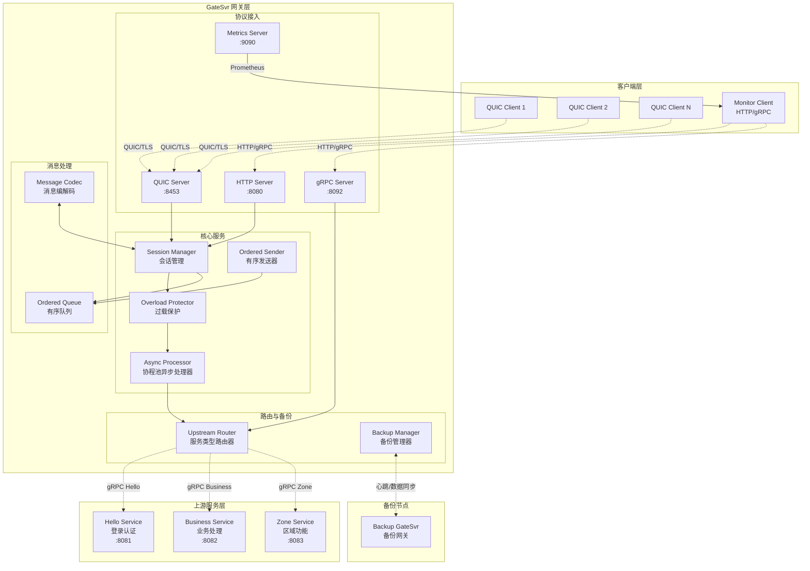
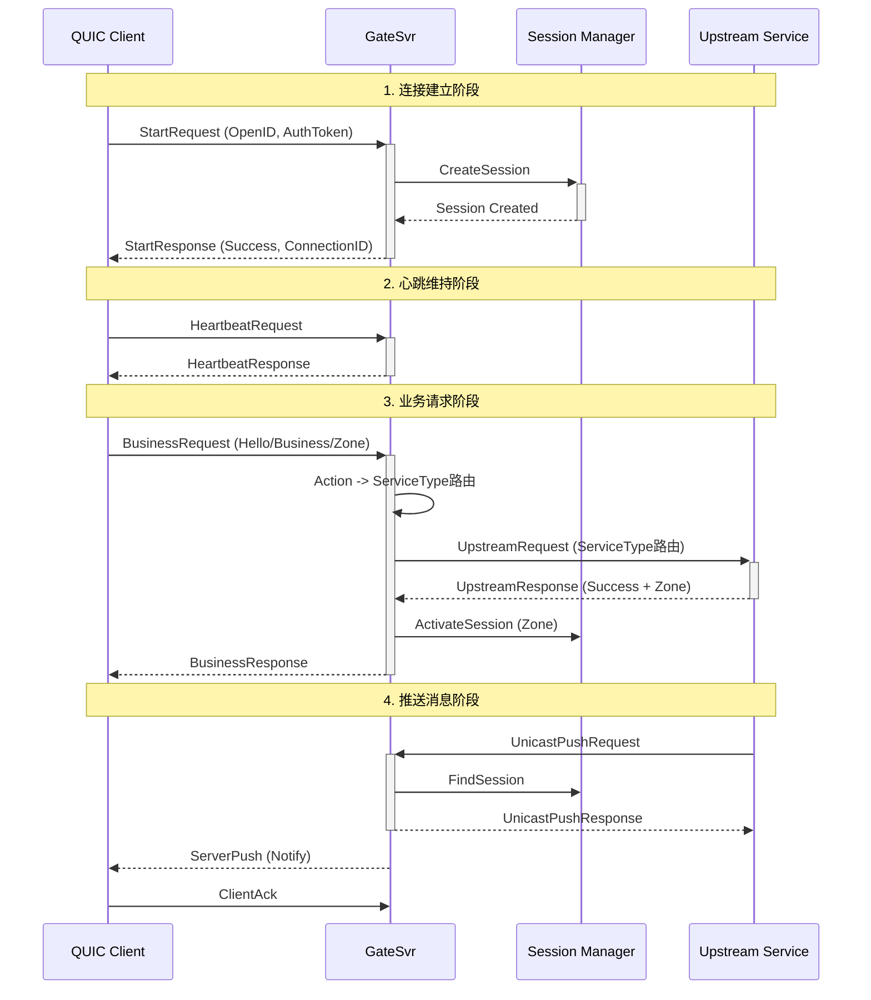
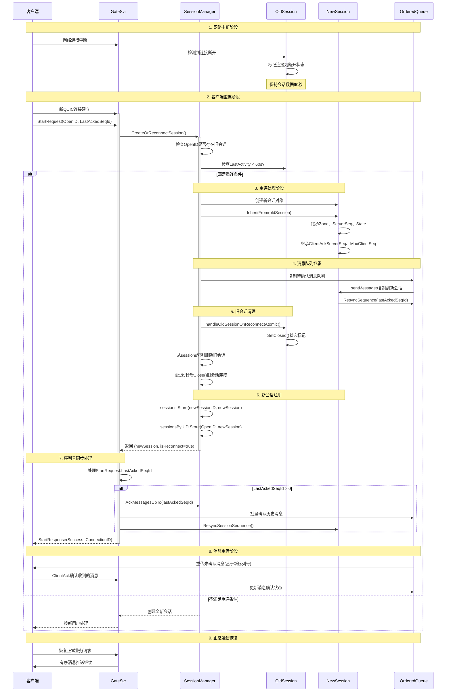

# GateSvr 技术设计文档

## 1. 摘要 (Executive Summary)

GateSvr 是一个基于 QUIC 协议的高性能网关服务器，专为大规模实时通信系统设计。项目采用 Go 语言开发，提供了完整的 session 管理、请求分发、消息推送和广播功能，支持双向消息时序保证和消息可靠性设计。

**核心功能特性：**
- **协议支持**: QUIC、HTTP、gRPC 多协议同时支持
- **消息可靠性**: 完整的 ACK 机制和有序消息队列
- **notify和response保序**: 支持消息时序保证机制
- **协程池异步处理**: 基于协程池的异步gRPC请求处理
- **过载保护**: 多维度过载保护机制

**技术栈：**
- **运行时**: Go 1.24+
- **传输协议**: QUIC-GO, gRPC
- **消息序列化**: Protocol Buffers
- **容器化**: Docker

## 2. 技术栈与依赖 (Tech Stack & Dependencies)

### 2.1 核心技术栈

| 技术 | 版本 | 用途 | 说明 |
|------|------|------|------|
| Go | 1.23+ | 运行时 | 主要开发语言 |
| QUIC-GO | v0.54.0 | 传输协议 | 提供低延迟可靠连接 |
| gRPC | v1.74.2 | 服务通信 | 上游服务调用 |
| Protocol Buffers | v1.36.6 | 消息序列化 | 高效的消息编解码 |
| Prometheus | v1.19.1 | 监控指标 | 系统监控和指标收集 |
| YAML | v3.0.1 | 配置管理 | 配置文件解析 |
| UUID | v1.6.0 | 会话标识 | 会话ID生成 |

### 2.2 架构选型说明

- **QUIC 协议**: 选择 QUIC 而非传统 TCP 的原因是其内置的多路复用、快速握手和网络切换支持
- **gRPC**: 用于与上游服务通信，提供类型安全和高性能的 RPC 调用
- **Protocol Buffers**: 提供跨语言、高效的消息序列化方案

## 3. 系统架构 (System Architecture)

### 3.1 整体架构设计(有问题)



### 3.2 数据流设计

#### 3.2.1 客户端请求处理流程



#### 3.2.2 服务类型路由算法

服务路由核心算法实现：

```go
// internal/gateway/upstream_routerold.go:14-29
func (s *Server) determineUpstreamService(businessReq *pb.BusinessRequest) upstream.ServiceType {
    action := strings.ToLower(businessReq.Action)

    // Hello服务：处理登录、认证相关请求
    if isHelloAction(action) {
        return upstream.ServiceTypeHello
    }

    // Zone服务：处理区域功能相关请求
    if isZoneAction(action) {
        return upstream.ServiceTypeZone
    }

    // 默认使用Business服务
    return upstream.ServiceTypeBusiness
}
```

**路由分配策略：**
- 基于Action动作名称进行服务类型路由
- Hello服务：hello, logout, status, heartbeat, data_sync
- Zone服务：zone, echo, calculate, time
- Business服务：默认处理其他业务请求
- 支持多上游服务类型配置和动态切换

## 4. 数据模型设计 (Data Model Design)

### 4.1 会话模型 (Session Model)

| 字段名 | 类型 | 说明 | 备注 |
|--------|------|------|------|
| ID | string | 会话唯一标识 | UUID格式 |
| Connection | *quic.Conn | QUIC连接对象 | 底层传输连接 |
| Stream | *quic.Stream | 双向流 | 消息收发通道 |
| CreateTime | time.Time | 创建时间 | 会话建立时间 |
| LastActivity | time.Time | 最后活跃时间 | 用于超时检测 |
| ClientID | string | 客户端标识 | 客户端唯一ID |
| OpenID | string | 用户标识 | 业务层用户ID |
| UserIP | string | 客户端IP | 用于日志和安全 |
| state | int32 | 会话状态 | Inited/Normal/Closed |
| zone | int64 | 分区标识 | Zone 001-006 |
| nextSeqID | uint64 | 下个序列号 | 服务端消息序列 |
| maxClientSeq | uint64 | 最大客户端序列号 | 客户端消息序列 |

**会话状态转换：**
```
Inited (初始化) -> Normal (正常) -> Closed (关闭)
     |              |                |
     |              |                |
   登录成功      会话超时/客户端断开    清理资源
```

### 4.2 消息协议模型

#### 4.2.1 客户端请求消息
```protobuf
message ClientRequest {
  uint32 msg_id = 1;           // 消息ID
  uint64 seq_id = 2;           // 序列号
  RequestType type = 3;        // 请求类型
  bytes payload = 4;           // 消息载荷
  map<string, string> headers = 5; // 扩展头部
  string openid = 6;           // 客户端标识
}
```

#### 4.2.2 服务端推送消息
```protobuf
message ServerPush {
  uint32 msg_id = 1;           // 消息ID
  uint64 seq_id = 2;           // 序列号
  PushType type = 3;           // 推送类型
  bytes payload = 4;           // 消息载荷
  map<string, string> headers = 5; // 扩展头部
}
```

#### 4.2.3 请求类型枚举
| 类型 | 值 | 说明 | 序列号要求 |
|------|-----|------|------------|
| REQUEST_START | 1 | 连接建立 | seq_id = 0 |
| REQUEST_STOP | 2 | 连接断开 | seq_id = 0 |
| REQUEST_HEARTBEAT | 3 | 心跳请求 | seq_id = 0 |
| REQUEST_BUSINESS | 4 | 业务请求 | seq_id > 0, 递增 |
| REQUEST_ACK | 5 | 确认消息 | seq_id = 0 |

### 4.3 上游服务模型

| 字段名 | 类型 | 说明 |
|--------|------|------|
| Address | string | 服务地址 "ip:port" |
| ZoneID | string | Zone标识 "001"-"006" |
| Client | pb.UpstreamServiceClient | gRPC客户端 |
| LastSeen | time.Time | 最后活跃时间 |
| IsHealthy | bool | 健康状态 |

**服务配置示例：**
```yaml
# test-config.yaml 中的多上游服务配置
upstream_services:
  hello:
    - "localhost:8081"      # Hello服务端口
  business:
    - "localhost:8082"      # Business服务端口  
  zone:
    - "localhost:8083"      # Zone服务端口
```

## 5. 核心模块分析 (Core Module Analysis)

### 5.1 会话管理器 (Session Manager)

**文件位置**: `internal/session/manager.go`, `internal/session/session.go`

**功能职责：**
- 会话生命周期管理 (创建、重连、清理)
- 会话状态维护 (Inited -> Normal -> Closed)
- 消息序列号验证和管理
- 会话超时检测和清理
- 消息保序和绑定通知处理

#### 5.1.1 会话状态管理

**会话状态枚举：**
```go
// 会话状态定义 (internal/session/session.go:15-21)
type SessionState int32

const (
    SessionInited SessionState = iota // 初始化状态，等待登录
    SessionNormal                     // 正常状态，可以处理业务请求
    SessionClosed                     // 已关闭状态
)
```

**状态转换逻辑：**
- **Inited → Normal**: 登录成功后激活会话
- **Normal → Closed**: 用户断开连接或会话超时
- **任何状态 → Closed**: 系统错误或强制关闭

#### 5.1.2 核心组件设计

**会话核心字段：**
```go
// 会话结构体 (internal/session/session.go:23-60)
type Session struct {
    // 基础信息
    ID           string       // 会话唯一标识
    Connection   *quic.Conn   // QUIC连接
    Stream       *quic.Stream // 双向流
    CreateTime   time.Time    // 创建时间
    LastActivity time.Time    // 最后活跃时间
    
    // 客户端信息
    ClientID string // 客户端标识
    OpenID   string // 用户标识
    UserIP   string // 客户端IP
    
    // 状态管理
    state int32 // 原子操作的状态字段
    zone  int64 // 分区标识符
    
    // 序列号管理
    nextSeqID          uint64 // 下一个消息序列号
    serverSeq          uint64 // 服务器序列号
    maxClientSeq       uint64 // 最大客户端序列号
    clientAckServerSeq uint64 // 客户端确认的服务器序列号
    
    // 消息管理
    orderedQueue    *OrderedMessageQueue     // 有序消息队列
    orderingManager *MessageOrderingManager  // 消息保序管理器
}
```

#### 5.1.3 重连机制设计

**重连处理逻辑：**
```go
// 会话创建或重连 (internal/session/manager.go:48-113)
func (m *Manager) CreateOrReconnectSession(conn *quic.Conn, stream *quic.Stream, 
    clientID, openID, userIP string) (*Session, bool) {
    
    // 1. 检查是否存在可重连的会话
    if openID != "" {
        if value, exists := m.sessionsByUID.Load(openID); exists {
            existingSession := value.(*Session)
            // 在60秒内支持重连
            if time.Since(existingSession.LastActivity) < m.connectionDownDelay*2 {
                // 执行重连逻辑
                return m.handleReconnection(existingSession, conn, stream)
            }
        }
    }
    
    // 2. 创建新会话
    return m.createNewSession(conn, stream, clientID, openID, userIP), false
}
```

**重连特性：**
- **时间窗口**: 60秒内支持无缝重连
- **状态继承**: 保持原有会话状态和Zone信息
- **序列号连续性**: 继承服务器和客户端序列号
- **消息队列保持**: 未确认消息保留在队列中
- **平滑切换**: 旧连接延迟清理，确保消息不丢失

## 5.7 客户端重连机制详细设计 (Client Reconnection Mechanism)

### 5.7.1 重连触发条件

客户端重连在以下情况下被触发：

1. **网络临时中断**: WiFi切换、移动网络切换、弱网环境等
2. **连接超时**: QUIC连接由于网络问题导致超时
3. **应用恢复**: 应用从后台恢复到前台
4. **系统网络重置**: 设备网络配置变更

### 5.7.2 重连识别机制

**重连检测逻辑 (internal/session/manager.go:48-114):**

```go
func (m *Manager) CreateOrReconnectSession(conn *quic.Conn, stream *quic.Stream, 
    clientID, openID, userIP string) (*Session, bool) {
    
    var oldSession *Session
    var isReconnect bool
    
    // 1. 检查是否存在可重连的旧会话
    if openID != "" {
        if value, exists := m.sessionsByUID.Load(openID); exists {
            existingSession := value.(*Session)
            // 检查重连时间窗口：60秒内支持重连
            if time.Since(existingSession.LastActivity) < m.connectionDownDelay*2 {
                oldSession = existingSession
                isReconnect = true
            }
        }
    }
    
    // 2. 创建新会话对象并设置基础信息...
    // 3. 执行原子重连处理...
}
```

**重连识别关键要素:**
- **OpenID匹配**: 通过用户标识OpenID查找旧会话
- **时间窗口验证**: 默认60秒内(connectionDownDelay*2)支持重连  
- **会话状态检查**: 旧会话必须处于可重连状态
- **原子操作**: 确保重连过程的线程安全性

### 5.7.3 重连处理流程图

完整的客户端重连处理流程：



### 5.7.4 会话数据继承机制

**会话继承实现 (internal/session/session.go:184-203):**

```go
func (s *Session) InheritFrom(oldSession *Session) {
    // 1. 继承业务状态
    s.SetZone(oldSession.Zone())                    // 继承分区信息
    s.SetServerSeq(oldSession.ServerSeq())          // 继承服务器序列号
    s.SetSuccessor(true)                            // 标记为继承会话
    
    // 2. 继承会话状态  
    if oldSession.IsNormal() {
        s.SetState(SessionNormal)                   // 保持登录状态
    }
    
    // 3. 继承序列号状态
    atomic.StoreUint64(&s.clientAckServerSeq, 
        oldSession.ClientAckServerSeq())            // 客户端已确认的服务器序列号
    atomic.StoreUint64(&s.maxClientSeq, 
        oldSession.MaxClientSeq())                  // 客户端最大序列号
        
    // 4. 重置有序队列序列号
    if oldSession.orderedQueue != nil && s.orderedQueue != nil {
        s.orderedQueue.ResyncSequence(oldSession.ClientAckServerSeq())
    }
}
```

**继承的关键数据:**
- **Zone信息**: 用户所属分区，影响上游服务路由
- **会话状态**: 保持SessionNormal，避免重新登录
- **序列号状态**: 服务器序列号、客户端序列号、ACK序列号
- **消息队列**: 未确认消息的完整复制

### 5.7.5 消息队列重建机制

**消息队列继承处理:**

```go
// 1. 复制待确认消息 (internal/session/manager.go:96)
copier.Copy(&newSession.orderedQueue.sentMessages, 
    &oldSession.orderedQueue.sentMessages)

// 2. 序列号重同步 (internal/session/ordered_queue.go)
func (q *OrderedMessageQueue) ResyncSequence(lastAckedSeqId uint64) {
    q.mu.Lock()
    defer q.mu.Unlock()
    
    // 更新已确认序列号
    q.lastAckedSeq = lastAckedSeqId
    
    // 清理已确认的消息
    for seq := range q.sentMessages {
        if seq <= lastAckedSeqId {
            delete(q.sentMessages, seq)
        }
    }
    
    // 重置期望序列号
    q.nextExpectedSeq = q.lastSentSeq + 1
}
```

**队列重建特性:**
- **消息保全**: 所有未确认消息完整保留
- **去重处理**: 客户端已确认消息自动清理
- **序列连续**: 确保消息序列号的严格递增
- **状态同步**: 队列状态与会话状态保持一致

### 5.7.6 序列号同步处理

**客户端序列号同步机制 (internal/gateway/handlers.go:277-284):**

```go
// StartRequest中的LastAckedSeqId处理
if startReq.LastAckedSeqId > 0 {
    // 批量确认历史消息
    ackedCount := s.sessionManager.AckMessagesUpTo(sess.ID, startReq.LastAckedSeqId)
    
    // 重置有序发送器的序列号状态
    s.orderedSender.ResyncSessionSequence(sess, startReq.LastAckedSeqId)
    
    log.Printf("重连时清除已确认消息 - 会话: %s, 最后确认序列号: %d, 清除数量: %d",
        sess.ID, startReq.LastAckedSeqId, ackedCount)
}
```

**序列号同步流程:**
1. **客户端上报**: 通过StartRequest.LastAckedSeqId告知最后确认的序列号
2. **服务端批量ACK**: 确认该序列号及之前的所有消息
3. **队列清理**: 从待确认队列中移除已确认消息  
4. **序列号重置**: 重新设置发送器的基准序列号
5. **消息重传**: 自动重传未确认的消息

### 5.7.7 旧会话清理机制

**延迟清理设计 (internal/session/manager.go:117-126):**

```go
func (m *Manager) handleOldSessionOnReconnectAtomic(oldSession, newSession *Session) {
    // 1. 立即标记旧会话为关闭状态
    oldSession.SetClosed()
    
    // 2. 从会话索引中移除，防止新请求路由到旧会话
    m.sessions.Delete(oldSession.ID)
    
    // 3. 延迟5秒后真正关闭连接，确保消息传输完成
    go func() {
        time.Sleep(5 * time.Second)
        oldSession.Close()  // 关闭QUIC连接和Stream
    }()
}
```

**清理策略说明:**
- **立即标记**: 防止新消息发送到旧连接
- **索引移除**: 确保路由到新会话
- **延迟关闭**: 给未传输完成的消息5秒缓冲时间
- **资源清理**: 最终释放QUIC连接、Stream等资源

### 5.7.8 重连时间窗口配置

**时间窗口参数 (internal/session/manager.go:38-46):**

```go
func NewManager(sessionTimeout, ackTimeout time.Duration, maxRetries int) *Manager {
    return &Manager{
        sessionTimeout:      sessionTimeout,      // 会话超时：默认5分钟
        ackTimeout:          ackTimeout,          // ACK超时：默认30秒  
        maxRetries:          maxRetries,          // 最大重试：默认3次
        connectionDownDelay: 30 * time.Second,    // 重连窗口：默认30秒
    }
}
```

**时间窗口说明:**
- **重连窗口**: 30秒 * 2 = 60秒内支持重连
- **会话超时**: 5分钟无活动自动清理会话
- **ACK超时**: 30秒未确认触发消息重传
- **连接清理延迟**: 30秒后彻底清理断开的连接

### 5.7.9 重连失败处理

**重连失败场景:**
1. **超出时间窗口**: 60秒后尝试重连视为新连接
2. **OpenID冲突**: 同一OpenID存在活跃会话时拒绝重连
3. **会话状态异常**: 旧会话已被清理或状态异常
4. **系统资源不足**: 内存、连接数超限时拒绝重连

**失败处理策略:**
```go
// 重连失败时按新用户处理
if !isReconnect {
    // 创建全新会话
    newSession = m.createNewSession(conn, stream, clientID, openID, userIP)
    // 要求客户端重新登录
    // 清空所有历史状态
}
```

### 5.7.10 重连性能优化

**优化措施:**
1. **原子操作**: 使用sync.Map确保并发安全
2. **内存复用**: 消息队列数据结构复用
3. **批量处理**: 批量ACK和消息清理
4. **异步清理**: 旧连接清理不阻塞重连处理
5. **索引优化**: 双重索引(SessionID + OpenID)快速查找

**性能指标:**
- 重连检测延迟: < 100ms
- 消息队列迁移: < 50ms  
- 状态继承处理: < 10ms
- 旧会话清理: 异步处理，不影响性能

#### 5.1.4 消息保序机制

**消息保序管理器：**
```go
// 消息保序管理器 (internal/session/notify_ordering.go:26-34)
type MessageOrderingManager struct {
    // 响应前notify消息
    beforeRspNotifies map[uint32][]*NotifyBindMsgItem
    // 响应后notify消息
    afterRspNotifies  map[uint32][]*NotifyBindMsgItem
    mu sync.RWMutex
}
```

**保序处理流程：**
1. **绑定消息**: notify消息按客户端请求序列号绑定
2. **Before-Response**: 在业务响应前发送的通知
3. **Business Response**: 业务响应消息
4. **After-Response**: 在业务响应后发送的通知

**绑定通知类型：**
```go
// 通知同步提示 (proto定义)
enum NotifySyncHint {
    NSH_IMMEDIATELY     = 0; // 立即发送
    NSH_BEFORE_RESPONSE = 1; // 响应前发送
    NSH_AFTER_RESPONSE  = 2; // 响应后发送
}
```

#### 5.1.5 有序消息队列

**队列设计特点：**
```go
// 有序消息队列 (internal/session/ordered_queue.go:41-60)
type OrderedMessageQueue struct {
    sessionID string
    
    waitingQueue MessageQueue               // 等待发送的消息队列
    sentMessages map[uint64]*OrderedMessage // 已发送待确认的消息
    
    // 序列号管理
    nextExpectedSeq uint64 // 下一个期望的序列号
    lastSentSeq     uint64 // 最后发送的序列号
    lastAckedSeq    uint64 // 最后确认的序列号
    
    maxQueueSize    int           // 最大队列大小
    sendCallback    func(*OrderedMessage) error // 发送回调
}
```

**队列核心功能：**
- **消息排序**: 基于堆结构确保消息按序列号发送
- **重传机制**: 超时未确认消息自动重传（最多3次）
- **批量确认**: 支持批量ACK提升性能
- **内存保护**: 队列满时拒绝新消息防止内存溢出
- **清理机制**: 定期清理超时和已确认的消息

#### 5.1.7 有序消息发送流程图

通过有序队列发送消息的完整流程：

```mermaid
graph TD
    A[业务层调用发送消息] --> B[OrderedMessageSender.SendOrderedMessage]
    
    B --> C[获取新的服务器序列号<br/>sess.NewServerSeq()]
    C --> D[设置消息序列号<br/>push.SeqId = serverSeq]
    D --> E[编码消息<br/>messageCodec.EncodeServerPush]
    
    E --> F[获取会话有序队列<br/>sess.GetOrderedQueue()]
    F --> G{队列是否已初始化?}
    
    G -->|否| H[返回错误:<br/>队列未初始化]
    G -->|是| I{是否设置了发送回调?}
    
    I -->|否| J[设置发送回调函数<br/>sendMessageDirectly]
    I -->|是| K[调用队列入队<br/>EnqueueMessage]
    J --> K
    
    K --> L[OrderedMessageQueue.EnqueueMessage]
    L --> M[获取队列锁]
    M --> N{队列是否已停止?}
    
    N -->|是| O[返回错误:<br/>队列已停止]
    N -->|否| P{队列是否已满?}
    
    P -->|是| Q[返回错误:<br/>队列已满]
    P -->|否| R[创建OrderedMessage对象]
    
    R --> S{serverSeq == nextExpectedSeq?}
    
    S -->|是| T[可以立即发送]
    S -->|否| U{serverSeq > nextExpectedSeq?}
    
    T --> V[调用sendMessageDirectly]
    V --> W{发送是否成功?}
    
    W -->|否| X[返回发送失败错误]
    W -->|是| Y[标记消息为已发送<br/>msg.Sent = true]
    
    Y --> Z[加入待确认队列<br/>sentMessages[serverSeq] = msg]
    Z --> AA[更新序列号<br/>nextExpectedSeq++<br/>lastSentSeq = serverSeq]
    AA --> BB[处理等待队列中的后续消息<br/>processWaitingMessages]
    
    U -->|是| CC[序列号太大，需等待<br/>加入等待队列heap.Push]
    U -->|否| DD[序列号太小，重复消息<br/>返回错误忽略]
    
    BB --> EE[检查等待队列头部消息]
    EE --> FF{头部消息序列号 == nextExpectedSeq?}
    
    FF -->|是| GG[从堆中取出消息<br/>heap.Pop]
    GG --> HH[尝试发送消息]
    HH --> II{发送成功?}
    
    II -->|否| JJ[重新放回等待队列<br/>结束处理]
    II -->|是| KK[标记为已发送<br/>加入待确认队列]
    KK --> LL[更新序列号<br/>继续处理下一个]
    LL --> EE
    
    FF -->|否| MM[等待队列处理完成<br/>返回成功]
    
    CC --> MM
    JJ --> MM
    
    %% 发送回调路径
    V --> NN[sendCallback函数]
    NN --> OO[OrderedMessageSender.sendMessageDirectly]
    OO --> PP{会话是否已关闭?}
    
    PP -->|是| QQ[返回错误:<br/>会话已关闭]
    PP -->|否| RR[通过Stream写入数据<br/>messageCodec.WriteMessage]
    
    RR --> SS{写入是否成功?}
    SS -->|否| TT[记录发送错误指标<br/>返回发送失败]
    SS -->|是| UU[更新吞吐量指标<br/>记录成功日志]
    
    %% 后台处理
    VV[后台清理协程<br/>cleanupLoop] --> WW[定期清理过期消息<br/>cleanupExpiredMessages]
    VV --> XX[重试超时消息<br/>retryTimedOutMessages]
    
    WW --> YY[清理待确认队列中<br/>超过重试次数的消息]
    WW --> ZZ[清理等待队列中<br/>的过期消息]
    
    XX --> AAA[遍历待确认消息]
    AAA --> BBB{消息是否超时且未达最大重试?}
    BBB -->|是| CCC[重新发送消息<br/>增加重试次数]
    BBB -->|否| DDD[继续检查下一个消息]
    
    %% 客户端ACK处理
    EEE[客户端发送ACK] --> FFF[AckMessagesUpTo]
    FFF --> GGG[批量确认序列号<=ackSeqID的消息]
    GGG --> HHH[从待确认队列中删除已确认消息]
    HHH --> III[更新lastAckedSeq]
    
    style A fill:#e1f5fe
    style B fill:#f3e5f5
    style T fill:#e8f5e8
    style CC fill:#fff3e0
    style DD fill:#ffebee
    style H fill:#ffebee
    style O fill:#ffebee
    style Q fill:#ffebee
    style X fill:#ffebee
    style QQ fill:#ffebee
    style TT fill:#ffebee
    style UU fill:#e8f5e8
    style MM fill:#e8f5e8
```

**流程说明：**

1. **消息准备阶段** (A-E):
   - 获取递增的服务器序列号
   - 设置消息序列号并编码

2. **队列处理阶段** (F-R):
   - 检查队列状态和发送回调
   - 创建有序消息对象

3. **发送判断阶段** (S-U):
   - **立即发送**: 序列号连续可直接发送
   - **等待发送**: 序列号跳跃需加入等待队列
   - **重复丢弃**: 序列号过小的重复消息

4. **实际发送阶段** (V-UU):
   - 通过回调函数发送到网络流
   - 更新发送状态和统计指标

5. **后续处理阶段** (BB-MM):
   - 处理等待队列中的连续消息
   - 维护消息的严格有序性

6. **后台维护** (VV-III):
   - 定期清理过期消息
   - 自动重试超时消息
   - 处理客户端批量确认

这个设计确保了消息的严格有序性和高可靠性传输。

#### 5.1.6 会话管理器功能

**双重索引设计：**
```go
// 会话管理器 (internal/session/manager.go:16-35)
type Manager struct {
    sessions      sync.Map // map[string]*Session 按会话ID索引
    sessionsByUID sync.Map // map[string]*Session 按用户ID索引
    
    // 超时配置
    sessionTimeout      time.Duration // 会话超时时间
    ackTimeout          time.Duration // ACK超时时间
    maxRetries          int           // 最大重试次数
    connectionDownDelay time.Duration // 连接断开延迟清理时间
}
```

**管理功能：**
- **会话索引**: 支持按会话ID和用户ID快速查找
- **超时清理**: 后台定期清理超时会话
- **并发安全**: 使用sync.Map确保线程安全
- **资源管理**: 会话关闭时自动清理相关资源
- **重连支持**: 智能检测和处理客户端重连

**配置参数：**
- **会话超时**: 默认5分钟无活动自动清理
- **ACK超时**: 默认30秒未确认触发重传
- **重连窗口**: 默认30秒内支持重连
- **队列大小**: 默认1000个消息的队列容量

### 5.2 服务类型路由器 (Service Type Router)

**文件位置**: `internal/gateway/upstream_routerold.go`, `internal/upstream/services.go`

**功能职责：**
- 基于Action动作的服务类型路由
- 多上游服务类型管理
- gRPC 连接池管理
- 服务可用性检查

**路由实现：**
```go
// 调用指定类型的上游服务 (internal/gateway/upstream_routerold.go:60-67)
func (s *Server) callUpstreamService(ctx context.Context, serviceType upstream.ServiceType, 
    req *pb.UpstreamRequest) (*pb.UpstreamResponse, error) {
    
    // 如果使用新的上游管理器
    if s.upstreamManager != nil {
        return s.upstreamManager.CallService(ctx, serviceType, req)
    }

    return nil, fmt.Errorf("没有可用的上游服务连接")
}
```

**服务管理：**
- 支持Hello、Business、Zone三种服务类型
- 动态服务配置和地址管理
- 服务启用/禁用控制

### 5.3 有序消息队列 (Ordered Queue)

**文件位置**: `internal/session/ordered_queue.go`

**功能职责：**
- 消息顺序保证
- ACK机制支持
- 消息重传处理
- 批量确认优化

**设计特点：**
- 每个会话独立的消息队列
- 支持批量ACK提升性能
- 消息超时重传机制
- 内存友好的滑动窗口设计

**批量ACK实现：**
```go
// 批量确认消息 (internal/session/manager.go:232-249)
func (m *Manager) AckMessagesUpTo(sessionID string, ackSeqID uint64) int {
    session, exists := m.GetSession(sessionID)
    if !exists {
        return 0
    }
    
    // 更新会话的ACK序列号
    session.UpdateAckServerSeq(ackSeqID)
    
    // 使用OrderedMessageQueue的批量确认功能
    orderedQueue := session.GetOrderedQueue()
    return orderedQueue.AckMessagesUpTo(ackSeqID)
}
```

### 5.4 协程池异步处理器 (Async Processor)

**文件位置**: `internal/gateway/async_processor.go`

**功能职责：**
- 基于协程池的异步gRPC请求处理
- 任务队列管理和负载均衡
- 会话状态检查和超时处理
- 异步任务执行监控

**核心特性：**
```go
// 异步处理器配置 (internal/gateway/async_processor.go:31-42)
type AsyncConfig struct {
    MaxWorkers   int           // 最大工作协程数
    MaxQueueSize int           // 任务队列大小
    TaskTimeout  time.Duration // 任务超时时间
}

var DefaultAsyncConfig = &AsyncConfig{
    MaxWorkers:   runtime.NumCPU() * 4,  // 默认CPU核数*4
    MaxQueueSize: 10000,                 // 默认队列大小10K
    TaskTimeout:  30 * time.Second,      // 默认超时30秒
}
```

**工作流程：**
1. **任务提交**: 业务请求转换为异步任务提交到队列
2. **协程池处理**: 工作协程从队列获取任务并处理
3. **上游调用**: 异步调用上游gRPC服务
4. **响应发送**: 处理完成后发送响应给客户端
5. **状态监控**: 实时监控队列长度和处理状态

**异步任务处理：**
```go
// 异步任务处理 (internal/gateway/async_processor.go:162-212)
func (ap *AsyncRequestProcessor) processTask(workerID int, task *AsyncTask) {
    // 1. 检查会话有效性
    if !ap.isSessionValid(task.Session) {
        return
    }
    
    // 2. 调用上游服务
    upstreamResp, err := ap.server.callUpstreamService(ctx, task.ServiceType, task.UpstreamReq)
    
    // 3. 发送before-notify消息
    grid := uint32(task.Request.SeqId)
    ap.server.sendBeforeNotifies(task.Session, grid)
    
    // 4. 发送业务响应
    ap.server.orderedSender.SendBusinessResponse(task.Session, task.Request.MsgId,
        upstreamResp.Code, upstreamResp.Message, upstreamResp.Data, upstreamResp.Headers)
    
    // 5. 发送after-notify消息
    ap.server.sendAfterNotifies(task.Session, grid)
}
```

**配置示例：**
```yaml
# 异步处理器配置 - 用于grpc异步调用
async:
  max_workers: 16          # 工作协程数，建议为CPU核数的4倍
  max_queue_size: 10000    # 异步任务队列大小
  task_timeout: "30s"      # 单个异步任务超时时间
```

**性能优势：**
- 非阻塞处理：客户端请求立即返回，不等待上游响应
- 并发处理：多个工作协程并行处理任务
- 资源隔离：独立的协程池避免影响主线程
- 过载保护：队列满时拒绝新任务，防止资源耗尽

### 5.5 过载保护器 (Overload Protector)

**文件位置**: `internal/gateway/overload_protector.go`

**保护维度：**
- 连接数限制 (max_connections: 1000)
- QPS限制 (max_qps: 2000, 10s窗口)
- 上游并发限制 (max_upstream_concurrent: 100)
- 上游请求超时 (upstream_timeout: 30s)

**保护策略：**
```go
// 过载保护配置示例
type OverloadConfig struct {
    Enabled                      bool
    MaxConnections              int    // 1000
    ConnectionWarningThreshold   int    // 800
    MaxQPS                      int    // 2000
    QPSWarningThreshold         int    // 1600
    QPSWindowSeconds            int    // 10
    MaxUpstreamConcurrent       int    // 100
    UpstreamTimeout             time.Duration // 30s
    UpstreamWarningThreshold    int    // 80
}
```

**保护机制：**
- 多级预警机制 (Warning Threshold)
- 快速失败避免雪崩
- 实时指标监控
- 梯度限流策略

### 5.6 备份管理器 (Backup Manager)

**文件位置**: `internal/backup/backup_manager.go`

**高可用特性：**
- Primary/Backup 双节点模式
- 心跳检测 (2s间隔, 6s超时)
- 数据实时同步 (批量: 50, 超时: 200ms)
- 自动故障切换 (切换超时: 10s)

**备份配置：**
```yaml
backup:
  enabled: true
  mode: "primary"              # primary 或 backup
  server_id: "gate-001"
  heartbeat:
    interval: "2s"
    peer_addr: "backup-server:8093"
    timeout: "6s"
  sync:
    peer_addr: "backup-server:8094"
    batch_size: 50
    timeout: "200ms"
    buffer_size: 1000
```

**故障切换流程：**
1. 心跳监测发现主节点失联
2. 备份节点等待检测超时 (6s)
3. 执行故障切换 (10s超时)
4. 备份节点升级为主节点
5. 恢复服务处理能力

## 6. 部署与环境 (Deployment & Environment)

### 6.1 端口配置

| 服务 | 端口 | 协议 | 用途 |
|------|------|------|------|
| QUIC Server | 8453 | QUIC/TLS | 客户端连接 |
| HTTP API | 8080 | HTTP | 管理接口、健康检查 |
| gRPC Server | 8092 | gRPC | 上游服务调用 |
| Metrics | 9090 | HTTP | Prometheus指标 |

### 6.2 Docker 部署

**Dockerfile 特点：**
```dockerfile
# 基于 golang:1.23-alpine 构建
# 多阶段构建，最小化镜像大小
# 运行时使用 alpine:latest
# 暴露端口: 8453, 8080, 8092, 9090
# 健康检查: HTTP /health 端点
# 入口命令: ./gatesvr -config=config.yaml
```

**Docker Compose 部署：**
```yaml
version: '3.8'
services:
  gatesvr:
    build: .
    ports:
      - "8453:8453"  # QUIC
      - "8080:8080"  # HTTP
      - "8092:8092"  # gRPC
      - "9090:9090"  # Metrics
    environment:
      - GATESVR_QUIC_ADDR=:8453
      - GATESVR_HTTP_ADDR=:8080
    volumes:
      - ./certs:/app/certs:ro
      - ./config.yaml:/app/config.yaml:ro
    healthcheck:
      test: ["CMD", "wget", "--quiet", "--tries=1", "--spider", "http://localhost:8080/health"]
      interval: 30s
      timeout: 10s
      retries: 3
```

### 6.3 环境变量配置

支持通过环境变量覆盖配置：

| 环境变量 | 说明 | 示例值 |
|----------|------|--------|
| GATESVR_QUIC_ADDR | QUIC监听地址 | :8453 |
| GATESVR_HTTP_ADDR | HTTP API地址 | :8080 |
| GATESVR_GRPC_ADDR | gRPC服务地址 | :8092 |
| GATESVR_METRICS_ADDR | 监控指标地址 | :9090 |
| GATESVR_CERT_FILE | TLS证书文件 | certs/server.crt |
| GATESVR_KEY_FILE | TLS私钥文件 | certs/server.key |

**配置优先级：**
1. 命令行参数 (最高)
2. 环境变量
3. 配置文件
4. 默认值 (最低)

### 6.4 监控与运维

#### 6.4.1 健康检查端点

| 端点 | 方法 | 说明 | 返回内容 |
|------|------|------|----------|
| `/health` | GET | 服务健康状态 | {"status": "healthy"} |
| `/stats` | GET | 会话统计信息 | 连接数、会话数、Zone分布 |
| `/performance` | GET | 性能监控数据 | QPS、延迟、吞吐量 |
| `/metrics` | GET | Prometheus指标 | 完整监控指标 |

#### 6.4.2 关键监控指标

| 指标名 | 类型 | 说明 |
|--------|------|------|
| gatesvr_active_connections | Gauge | 活跃连接数 |
| gatesvr_total_requests | Counter | 总请求数 |
| gatesvr_request_duration | Histogram | 请求处理时间 |
| gatesvr_upstream_requests | Counter | 上游请求数 |
| gatesvr_message_queue_size | Gauge | 消息队列大小 |
| gatesvr_session_count | Gauge | 活跃会话数 |
| gatesvr_async_queue_size | Gauge | 异步处理队列大小 |
| gatesvr_async_tasks_total | Counter | 异步任务总数 |
| gatesvr_async_task_duration | Histogram | 异步任务处理时间 |
| gatesvr_service_distribution | Gauge | 服务类型负载分布 |

#### 6.4.3 日志管理

**日志配置：**
- 文件：`gatesvr.log`
- 最大大小：3MB
- 保留文件：5个
- 格式：时间戳 + 文件名 + 行号 + 消息

**日志轮转：**
```
gatesvr.log      <- 当前日志
gatesvr.log.1    <- 最近轮转
gatesvr.log.2
gatesvr.log.3
gatesvr.log.4
gatesvr.log.5    <- 最旧文件
```

### 6.5 生产部署建议

#### 6.5.1 推荐配置

```yaml
server:
  quic_addr: ":8453"
  http_addr: ":8080"
  grpc_addr: ":8092"
  metrics_addr: ":9090"
  cert_file: "certs/server.crt"
  key_file: "certs/server.key"
  session_timeout: "5m"
  ack_timeout: "30s"
  max_retries: 3

overload_protection:
  enabled: true
  max_connections: 10000          # 生产环境建议10K
  connection_warning_threshold: 8000
  max_qps: 20000                  # 生产环境建议20K
  qps_warning_threshold: 16000
  qps_window_seconds: 10
  max_upstream_concurrent: 1000   # 生产环境建议1K
  upstream_timeout: "30s"
  upstream_warning_threshold: 800

backup:
  enabled: true
  mode: "primary"
  server_id: "gate-prod-001"
  heartbeat:
    interval: "2s"
    peer_addr: "backup-server:8093"
    timeout: "6s"
  sync:
    peer_addr: "backup-server:8094"
    batch_size: 100               # 生产环境建议更大批次
    timeout: "200ms"
    buffer_size: 10000            # 生产环境建议更大缓冲区
```

#### 6.5.2 资源规划

**硬件要求：**
- CPU: 8核以上
- 内存: 16GB以上
- 网络: 万兆网卡
- 存储: SSD 100GB以上

**容器资源限制：**
```yaml
resources:
  requests:
    memory: "2Gi"
    cpu: "1000m"
  limits:
    memory: "8Gi"
    cpu: "4000m"
```

#### 6.5.3 高可用部署

**双节点部署架构：**
```
[LB] -> [Primary GateSvr]   <-- 心跳同步 --> [Backup GateSvr]
         |                                     |
         |                                     |
     [Zone 001-003]                      [Zone 004-006]
     上游服务集群                        上游服务集群
```

**负载均衡配置：**
- 使用 HAProxy 或 Nginx 做 L4 负载均衡
- 健康检查：HTTP GET /health
- 故障转移时间：< 10s
- Session粘性：基于 OpenID 路由

---

## 附录

### A. 配置文件模板

完整的生产配置文件模板位于 `test-config.yaml`，包含所有可配置项和详细注释。

### B. API接口文档

详细的 Protocol Buffers 接口定义位于：
- `proto/message.proto` - 客户端消息协议
- `proto/upstream.proto` - 上游服务协议

### C. 开发工具

```bash
# 安装开发工具
make tools

# 代码格式化
make fmt

# 静态分析
make vet

# 代码检查
make lint

# 生成 Proto 文件
make proto

# 构建项目
make build

# 运行测试
make test
```

### D. 故障排查指南

常见问题和解决方案：

1. **连接建立失败** - 检查证书、端口、防火墙
2. **消息推送失败** - 检查上游服务注册、会话状态
3. **性能问题** - 调整过载保护配置、监控资源使用
4. **备份切换失败** - 检查心跳配置、网络连通性

---

*文档版本: v1.0*  
*最后更新: 2025-01-12*  
*维护者: GateSvr Team*