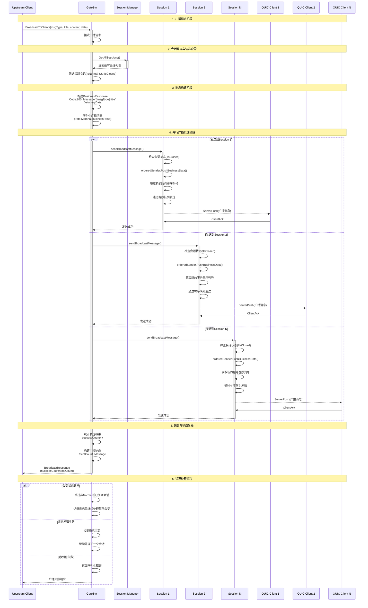

# 广播流程图

基于技术设计文档3.2.1流程图风格和unicast_service.go代码逻辑绘制的广播流程图。

## 流程图

## 广播流程关键特点

1. **会话筛选**: 只向`IsNormal() && !IsClosed()`的活跃会话广播
2. **消息统一**: 所有客户端收到相同格式的BusinessResponse消息
3. **并行发送**: 对所有目标会话并行执行广播，提高效率
4. **有序保证**: 每个会话内的消息通过有序队列保证顺序性
5. **错误容错**: 单个会话发送失败不影响其他会话的广播
6. **统计反馈**: 返回成功发送的会话数量和总会话数

## 代码位置参考

- 广播服务实现: `internal/gateway/unicast_service.go:79-109`
- 广播消息发送: `internal/gateway/unicast_service.go:111-133`
- 会话管理器: `internal/session/manager.go`
- 有序发送器: 通过`orderedSender.PushBusinessData()`调用