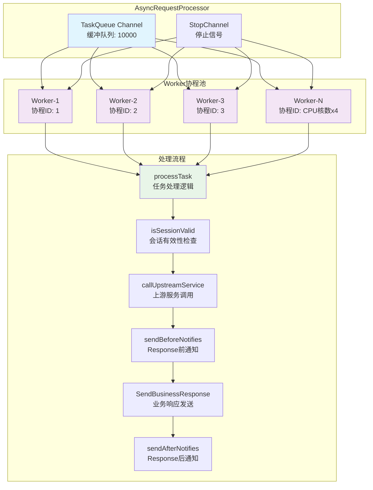
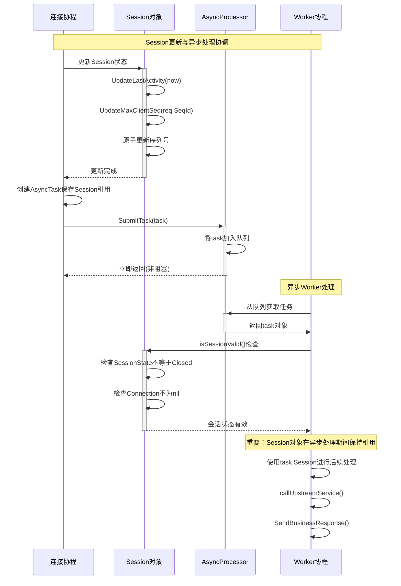

# 异步处理器消息流程分析

基于`async_processor.go`和`handlers.go`的代码分析，详细说明消息处理过程中session更新后异步调用上游服务的完整流程。

## 1. 异步处理架构概览

### 1.1 核心组件

| 组件 | 文件位置 | 职责 |
|------|----------|------|
| AsyncRequestProcessor | `internal/gateway/async_processor.go` | 异步任务处理器，管理协程池和任务队列 |
| AsyncTask | `internal/gateway/async_processor.go:17-28` | 异步任务结构，封装请求上下文 |
| handlers.go | `internal/gateway/handlers.go` | 业务请求处理入口，决定同步/异步处理模式 |

### 1.2 异步处理配置

```go
// 异步处理配置 (async_processor.go:31-42)
type AsyncConfig struct {
    MaxWorkers   int           // 最大工作协程数，默认CPU核数*4
    MaxQueueSize int           // 任务队列大小，默认10000
    TaskTimeout  time.Duration // 任务超时时间，默认30秒
}

var DefaultAsyncConfig = &AsyncConfig{
    MaxWorkers:   runtime.NumCPU() * 4,  // 默认CPU核数*4
    MaxQueueSize: 10000,                 // 默认队列大小10K
    TaskTimeout:  30 * time.Second,      // 默认超时30秒
}
```

## 2. 异步处理完整流程

### 2.1 主流程时序图

```mermaid
sequenceDiagram
    participant C as QUIC客户端
    participant H as 连接处理协程
    participant SM as SessionManager
    participant AP as AsyncProcessor
    participant WP as Worker协程池
    participant US as 上游服务
    participant OMS as OrderedSender
    
    Note over C,OMS: 1. 客户端请求接收与session更新
    C->>+H: BusinessRequest(SeqId=123, Action="business")
    H->>H: 解析并验证请求
    H->>+SM: 更新Session状态
    SM->>SM: UpdateLastActivity()和UpdateMaxClientSeq()
    SM-->>-H: Session更新完成
    
    Note over C,OMS: 2. 路由决策与任务构建
    H->>H: determineUpstreamService(businessReq)判断服务类型
    H->>H: 检查是否为Hello请求
    
    alt Hello请求(登录类)
        Note over H: 同步处理路径
        H->>H: handleBusinessRequestSync()
        H->>US: 直接同步调用上游服务
        US-->>H: 返回响应
        H->>OMS: 发送响应给客户端
        OMS-->>C: BusinessResponse
    else 非Hello请求(业务类)
        Note over H,WP: 异步处理路径
        H->>H: 创建AsyncTask对象包含TaskID等信息
        H->>H: 创建独立Context设置超时30s
        
        Note over C,OMS: 3. 异步任务提交
        H->>+AP: SubmitTask(asyncTask)
        AP->>AP: 检查队列容量
        
        alt 队列未满
            AP->>AP: 将task加入任务队列
            AP-->>-H: 提交成功(true)
            H-->>-C: 请求已接收(非阻塞返回)
            
            Note over C,OMS: 4. 异步任务处理
            WP->>+AP: worker从队列获取任务
            AP->>WP: 返回task对象
            
            Note over WP,US: 5. 会话有效性检查
            WP->>WP: isSessionValid(task.Session)
            WP->>WP: 检查SessionState不等于Closed
            WP->>WP: 检查Connection不为nil
            
            alt 会话有效
                Note over WP,US: 6. 上游服务调用
                WP->>+US: callUpstreamService(ctx, serviceType, upstreamReq)
                US->>US: 处理业务逻辑
                US-->>-WP: UpstreamResponse(Code, Message, Data)
                
                Note over WP,OMS: 7. Before-Response Notify处理
                WP->>WP: 获取grid等于task.Request.SeqId
                WP->>+SM: sendBeforeNotifies(session, grid)
                SM->>SM: GetAndRemoveBeforeNotifies(grid)
                loop 发送Before通知
                    SM->>OMS: SendOrderedMessage(notify)
                    OMS-->>C: ServerPush(Notify)
                end
                SM-->>-WP: Before通知发送完成
                
                Note over WP,OMS: 8. Business Response发送
                WP->>+OMS: SendBusinessResponse参数包含session等
                OMS->>OMS: 获取新序列号sess.NewServerSeq()
                OMS->>OMS: 通过有序队列发送
                OMS-->>-C: BusinessResponse(有序发送)
                
                Note over WP,OMS: 9. After-Response Notify处理
                WP->>+SM: sendAfterNotifies(session, grid)
                SM->>SM: GetAndRemoveAfterNotifies(grid)
                loop 发送After通知
                    SM->>OMS: SendOrderedMessage(notify)
                    OMS-->>C: ServerPush(Notify)
                end
                SM-->>-WP: After通知发送完成
                
                WP-->>-AP: 任务处理完成
                
            else 会话已失效
                WP->>WP: 记录日志，跳过处理
                WP-->>AP: 任务跳过
            end
            
        else 队列已满
            AP-->>H: 提交失败(false)
            H->>OMS: SendErrorResponse(503, "服务繁忙")
            OMS-->>C: ErrorResponse
        end
    end
    
    Note over C,OMS: 10. 客户端确认
    C->>H: ClientAck(响应序列号)
    H->>SM: 更新ACK状态
```

### 2.2 异步任务结构设计

```go
// 异步任务封装 (async_processor.go:17-28)
type AsyncTask struct {
    TaskID      string                    // 任务唯一标识: sessionID-seqID
    SessionID   string                    // 会话ID
    Session     *session.Session          // 会话对象引用
    Request     *pb.ClientRequest         // 原始客户端请求
    BusinessReq *pb.BusinessRequest       // 业务请求内容
    ServiceType upstream.ServiceType      // 目标上游服务类型
    UpstreamReq *pb.UpstreamRequest      // 上游请求对象
    Context     context.Context          // 独立的超时上下文
    IsLogin     bool                     // 是否为登录类请求
}
```

### 2.3 协程池工作模式



## 3. 关键处理节点分析

### 3.1 同步vs异步决策逻辑

```go
// 路由决策逻辑 (handlers.go:109-114)
if isLoginAction {
    log.Printf("Hello请求使用同步处理 - 会话: %s, 动作: %s", sess.ID, businessReq.Action)
    return s.handleBusinessRequestSync(ctx, sess, req, businessReq, serviceType, upstreamReq,
        upstreamCtx, isLoginAction)
}
```

**决策规则:**
- **Hello请求**: 必须同步处理，因为需要等待登录结果更新session状态
- **Business请求**: 异步处理，提升并发性能
- **Zone请求**: 异步处理，避免阻塞连接协程

### 3.2 任务提交与队列管理

```go
// 任务提交逻辑 (async_processor.go:111-128)
func (ap *AsyncRequestProcessor) SubmitTask(task *AsyncTask) bool {
    if !ap.started {
        log.Printf("异步处理器未启动，拒绝任务: %s", task.TaskID)
        return false
    }

    select {
    case ap.taskQueue <- task:
        log.Printf("异步任务已提交 - 任务ID: %s, 会话: %s, 动作: %s",
            task.TaskID, task.SessionID, task.BusinessReq.Action)
        return true
    default:
        // 队列已满，拒绝任务
        log.Printf("异步队列已满，拒绝任务 - 任务ID: %s, 会话: %s",
            task.TaskID, task.SessionID)
        return false
    }
}
```

**队列管理特性:**
- **非阻塞提交**: 使用`select default`避免阻塞连接协程
- **容量保护**: 队列满时拒绝新任务，返回503错误
- **任务标识**: 使用`sessionID-seqID`格式的唯一任务ID

### 3.3 Session更新与异步处理的协调



### 3.4 上游服务调用超时控制

```go
// 独立超时上下文创建 (handlers.go:118-124)
asyncCtx := context.Background()
if s.overloadProtector.config != nil && s.overloadProtector.config.UpstreamTimeout > 0 {
    var cancel context.CancelFunc
    asyncCtx, cancel = context.WithTimeout(context.Background(), s.overloadProtector.config.UpstreamTimeout)
    _ = cancel  // 异步任务生命周期独立管理
}
```

**超时控制特性:**
- **独立Context**: 异步任务使用独立的context.Background()
- **超时设置**: 默认30秒上游调用超时
- **生命周期分离**: 与连接协程的处理生命周期解耦

### 3.5 会话有效性检查机制

```go
// 会话有效性检查 (async_processor.go:215-231)
func (ap *AsyncRequestProcessor) isSessionValid(sess *session.Session) bool {
    if sess == nil {
        return false
    }

    // 检查会话状态是否已关闭
    if int32(sess.State()) == int32(session.SessionClosed) {
        return false
    }

    // 检查连接是否仍然有效
    if sess.Connection == nil {
        return false
    }

    return true
}
```

**检查维度:**
1. **空指针检查**: Session对象是否为nil
2. **状态检查**: 会话是否已关闭(SessionClosed)
3. **连接检查**: QUIC连接是否仍然有效

## 4. Notify消息保序处理

### 4.1 Before/After Response Notify流程

```go
// Before-Response Notify处理 (async_processor.go:194-197)
grid := uint32(task.Request.SeqId)
if err := ap.server.sendBeforeNotifies(task.Session, grid); err != nil {
    log.Printf("异步处理response 之前发送的 notify消息失败 - 任务: %s, 错误: %v", task.TaskID, err)
}

// Business Response发送 (async_processor.go:199-203)
if err := ap.server.orderedSender.SendBusinessResponse(task.Session, task.Request.MsgId,
    upstreamResp.Code, upstreamResp.Message, upstreamResp.Data, upstreamResp.Headers); err != nil {
    log.Printf("异步发送业务响应失败 - 任务: %s, 错误: %v", task.TaskID, err)
    return
}

// After-Response Notify处理 (async_processor.go:205-208)
if err := ap.server.sendAfterNotifies(task.Session, grid); err != nil {
    log.Printf("异步处理response之后发送的notify消息失败 - 任务: %s, 错误: %v", task.TaskID, err)
}
```

**保序发送顺序:**
1. **Before-Notify**: 绑定到客户端请求序列号的前置通知
2. **Business-Response**: 主要业务响应消息
3. **After-Notify**: 绑定到客户端请求序列号的后置通知

## 5. 性能优化与容错设计

### 5.1 性能优化措施

| 优化项 | 实现方式 | 效果 |
|--------|----------|------|
| **非阻塞提交** | channel select default | 连接协程不被异步队列阻塞 |
| **协程池复用** | 固定数量Worker协程 | 避免协程创建销毁开销 |
| **独立Context** | context.Background() | 异步任务生命周期独立 |
| **会话引用** | 直接传递Session指针 | 避免频繁查找Session |
| **批量处理** | Worker持续消费队列 | 提升任务处理吞吐量 |

### 5.2 容错机制

```go
// 容错处理示例 (async_processor.go:174-192)
// 检查会话是否仍然有效
if !ap.isSessionValid(task.Session) {
    log.Printf("会话已失效，跳过任务处理 - 任务: %s, 会话: %s", task.TaskID, task.SessionID)
    return
}

// 上游服务调用容错
upstreamResp, err := ap.server.callUpstreamService(ctx, task.ServiceType, task.UpstreamReq)
if err != nil {
    serviceInfo := ap.server.getUpstreamServiceInfo(task.ServiceType)
    log.Printf("异步调用上游服务失败 - 任务: %s, 服务: %s, 错误: %v",
        task.TaskID, serviceInfo, err)
    ap.server.metrics.IncError("upstream_error")
    ap.server.sendErrorResponse(task.Session, task.Request.MsgId, 500, "上游服务错误", err.Error())
    return
}
```

### 5.3 监控与统计

```go
// 异步处理器统计信息 (async_processor.go:136-143)
func (ap *AsyncRequestProcessor) GetStats() map[string]interface{} {
    return map[string]interface{}{
        "max_workers":    ap.config.MaxWorkers,    // 最大工作协程数
        "max_queue_size": ap.config.MaxQueueSize,  // 最大队列容量
        "queue_length":   ap.GetQueueLength(),     // 当前队列长度
        "started":        ap.started,              // 处理器启动状态
    }
}
```

## 6. 关键代码解析

### 6.1 Worker协程主循环

```go
// Worker协程工作循环 (async_processor.go:146-159)
func (ap *AsyncRequestProcessor) worker(workerID int) {
    defer ap.wg.Done()
    log.Printf("异步工作协程启动 - ID: %d", workerID)

    for {
        select {
        case task := <-ap.taskQueue:
            ap.processTask(workerID, task)  // 处理任务
        case <-ap.stopCh:
            log.Printf("异步工作协程停止 - ID: %d", workerID)
            return  // 收到停止信号，退出循环
        }
    }
}
```

### 6.2 任务处理核心逻辑

```go
// 异步任务处理核心 (async_processor.go:162-212)
func (ap *AsyncRequestProcessor) processTask(workerID int, task *AsyncTask) {
    startTime := time.Now()
    
    defer func() {
        processingTime := time.Since(startTime)
        log.Printf("异步任务处理完成 - 工作协程: %d, 任务: %s, 耗时: %.2fms",
            workerID, task.TaskID, processingTime.Seconds()*1000)
    }()

    // 1. 会话有效性检查
    if !ap.isSessionValid(task.Session) {
        log.Printf("会话已失效，跳过任务处理 - 任务: %s, 会话: %s", task.TaskID, task.SessionID)
        return
    }

    // 2. 上游服务调用
    ctx := task.Context
    upstreamResp, err := ap.server.callUpstreamService(ctx, task.ServiceType, task.UpstreamReq)
    if err != nil {
        // 错误处理...
        return
    }

    // 3. 保序消息发送
    grid := uint32(task.Request.SeqId)
    
    // Before-Response Notify
    ap.server.sendBeforeNotifies(task.Session, grid)
    
    // Business Response
    ap.server.orderedSender.SendBusinessResponse(task.Session, task.Request.MsgId,
        upstreamResp.Code, upstreamResp.Message, upstreamResp.Data, upstreamResp.Headers)
    
    // After-Response Notify
    ap.server.sendAfterNotifies(task.Session, grid)
}
```

## 7. 总结

异步处理器通过以下机制实现了高性能的消息处理:

### 7.1 核心设计原则
1. **连接协程非阻塞**: 快速处理请求并立即返回，避免阻塞QUIC连接
2. **Session状态一致性**: 在连接协程中完成session更新，异步协程处理业务逻辑
3. **资源隔离**: 异步任务使用独立的协程池和上下文，避免相互影响
4. **消息保序**: 通过OrderedSender确保响应消息的严格有序性

### 7.2 性能优势
- ✅ **高并发**: 连接协程快速释放，支持更多并发连接
- ✅ **弹性处理**: 协程池大小可配置，适应不同负载
- ✅ **容错能力**: 多层异常检查，保证系统稳定性
- ✅ **监控透明**: 完整的统计信息和日志记录

### 7.3 适用场景
- **高频业务请求**: 避免阻塞连接协程，提升吞吐量
- **长耗时操作**: 上游服务调用时间较长的场景
- **保序要求**: 需要严格保证消息顺序的业务场景

这种异步处理设计有效解决了传统同步处理中连接协程阻塞的问题，大幅提升了系统的并发处理能力。