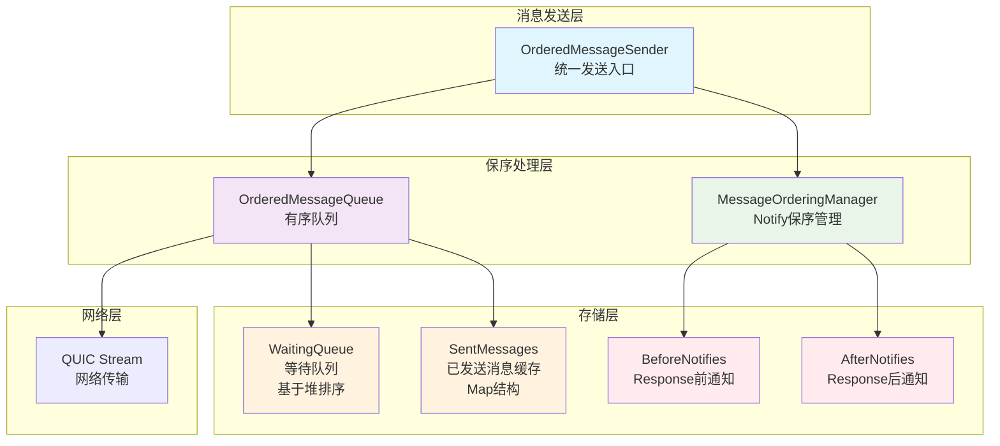
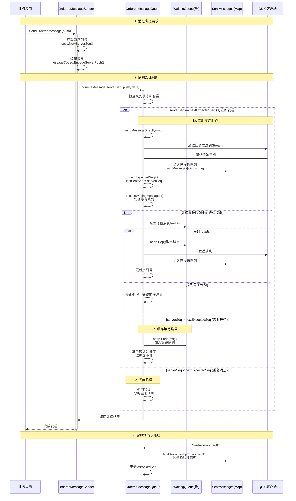
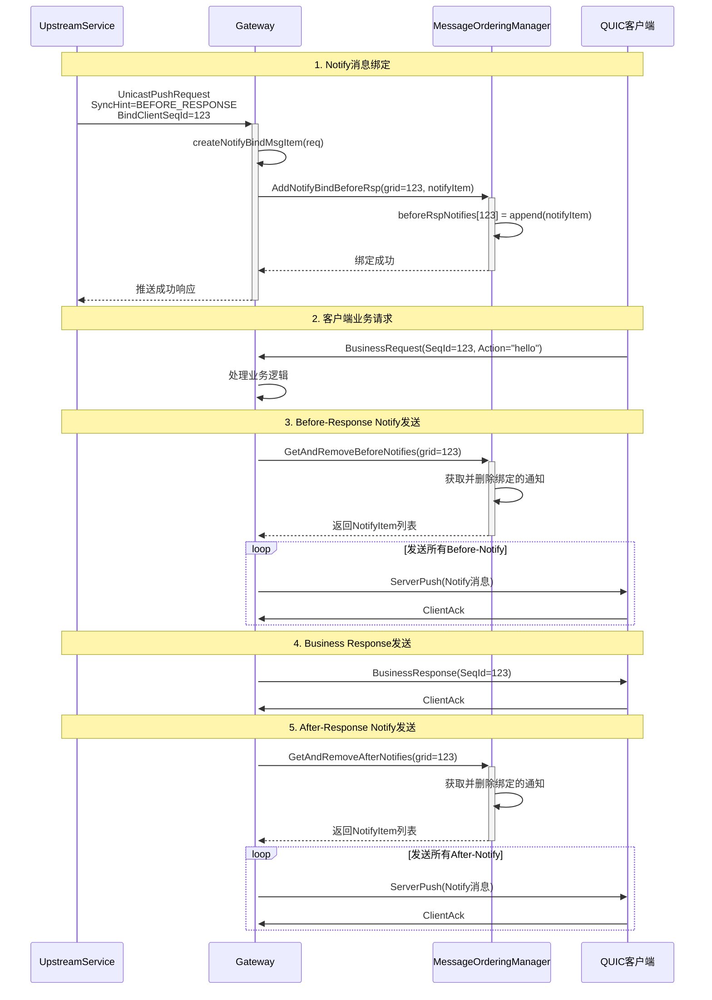

# 有序队列消息保序与缓存机制分析

基于项目中`ordered_sender.go`、`ordered_queue.go`和`notify_ordering.go`文件的分析，详细说明消息保序和缓存的实现机制。

## 1. 架构概览

### 1.1 核心组件

| 组件 | 文件 | 职责 |
|------|------|------|
| OrderedMessageSender | `internal/gateway/ordered_sender.go` | 有序消息发送器，统一消息发送入口 |
| OrderedMessageQueue | `internal/session/ordered_queue.go` | 有序消息队列，实现消息保序和缓存 |
| MessageOrderingManager | `internal/session/notify_ordering.go` | 通知消息保序管理器，实现Response前后的Notify绑定 |

### 1.2 消息流处理架构



## 2. 有序队列消息保序机制

### 2.1 序列号管理

```go
// 关键序列号字段 (ordered_queue.go:48-51)
type OrderedMessageQueue struct {
    nextExpectedSeq uint64  // 下一个期望的序列号
    lastSentSeq     uint64  // 最后发送的序列号  
    lastAckedSeq    uint64  // 最后确认的序列号
}
```

**序列号规则:**
- `nextExpectedSeq`: 严格递增，确保消息按序发送
- `lastSentSeq`: 记录最后发送的消息序列号
- `lastAckedSeq`: 客户端确认的最大序列号

### 2.2 消息保序流程



### 2.3 核心保序算法

```go
// 消息入队保序逻辑 (ordered_queue.go:111-133)
func (omq *OrderedMessageQueue) EnqueueMessage(serverSeq uint64, push *pb.ServerPush, data []byte) error {
    // 1. 检查是否可以立即发送 (序列号连续)
    if serverSeq == omq.nextExpectedSeq {
        // 立即发送并更新序列号
        if err := omq.sendMessageDirectly(orderedMsg); err != nil {
            return fmt.Errorf("发送消息失败: %w", err)
        }
        omq.sentMessages[serverSeq] = orderedMsg
        omq.nextExpectedSeq++
        omq.lastSentSeq = serverSeq
        
        // 尝试发送等待队列中的后续消息
        omq.processWaitingMessages()
        
    } else if serverSeq > omq.nextExpectedSeq {
        // 序列号跳跃，需要缓存等待
        heap.Push(&omq.waitingQueue, orderedMsg)
        
    } else {
        // 重复或过期消息，直接丢弃
        return fmt.Errorf("消息序列号 %d 小于期望序列号 %d，忽略", 
            serverSeq, omq.nextExpectedSeq)
    }
    
    return nil
}
```

## 3. 消息缓存机制

### 3.1 多级缓存结构

```mermaid
graph TB
    subgraph "等待发送缓存"
        WQ[WaitingQueue<br/>最小堆结构<br/>按序列号排序]
        WQ_DESC[存储等待发送的消息<br/>序列号跳跃时缓存<br/>容量限制: maxQueueSize]
    end
    
    subgraph "已发送缓存"
        SM[SentMessages<br/>Map结构<br/>seqID -> OrderedMessage]
        SM_DESC[存储已发送待确认的消息<br/>支持重传和批量ACK<br/>客户端确认后清理]
    end
    
    subgraph "Notify绑定缓存"
        BN[BeforeNotifies<br/>Map结构<br/>grid -> []NotifyItem]
        AN[AfterNotifies<br/>Map结构<br/>grid -> []NotifyItem] 
        BIND_DESC[按客户端请求序列号绑定<br/>在Business Response前后发送<br/>支持超时清理]
    end
    
    WQ --> WQ_DESC
    SM --> SM_DESC
    BN --> BIND_DESC
    AN --> BIND_DESC
    
    style WQ fill:#e1f5fe
    style SM fill:#f3e5f5
    style BN fill:#e8f5e8
    style AN fill:#e8f5e8
```

### 3.2 等待队列缓存机制

```go
// 基于堆的等待队列 (ordered_queue.go:21-33)
type MessageQueue []*OrderedMessage

func (mq MessageQueue) Less(i, j int) bool { 
    return mq[i].ServerSeq < mq[j].ServerSeq  // 最小堆，序列号小的优先
}

// 处理等待队列中的连续消息 (ordered_queue.go:136-153)
func (omq *OrderedMessageQueue) processWaitingMessages() {
    for len(omq.waitingQueue) > 0 {
        topMsg := omq.waitingQueue[0]
        if topMsg.ServerSeq == omq.nextExpectedSeq {
            // 序列号连续，可以发送
            msg := heap.Pop(&omq.waitingQueue).(*OrderedMessage)
            if err := omq.sendMessageDirectly(msg); err != nil {
                // 发送失败，重新放回队列
                heap.Push(&omq.waitingQueue, msg)
                break
            }
            // 发送成功，更新状态
            msg.Sent = true
            omq.sentMessages[msg.ServerSeq] = msg
            omq.nextExpectedSeq++
            omq.lastSentSeq = msg.ServerSeq
        } else {
            // 序列号不连续，停止处理
            break
        }
    }
}
```

### 3.3 已发送消息缓存与重传

```go
// 已发送消息结构 (ordered_queue.go:12-19)
type OrderedMessage struct {
    ServerSeq uint64        // 服务器序列号
    Push      *pb.ServerPush // 原始消息
    Data      []byte        // 编码后数据
    Timestamp time.Time     // 发送时间戳
    Retries   int          // 重试次数
    Sent      bool         // 是否已发送
}

// 超时重传机制 (ordered_queue.go:272-285)
func (omq *OrderedMessageQueue) retryTimedOutMessages() {
    now := time.Now()
    for _, msg := range omq.sentMessages {
        // 检查是否超时且未达最大重试次数
        if now.Sub(msg.Timestamp) > MessageTimeout/2 && msg.Retries < MaxRetries {
            if omq.sendCallback != nil && omq.sendCallback(msg) == nil {
                msg.Retries++
                msg.Timestamp = now
            }
        }
    }
}

// 批量确认清理机制 (ordered_queue.go:211-228)
func (omq *OrderedMessageQueue) AckMessagesUpTo(ackSeqID uint64) int {
    ackedCount := 0
    for seqID := range omq.sentMessages {
        if seqID <= ackSeqID {
            delete(omq.sentMessages, seqID)  // 清理已确认消息
            ackedCount++
        }
    }
    
    if ackSeqID > omq.lastAckedSeq {
        omq.lastAckedSeq = ackSeqID
    }
    
    return ackedCount
}
```

## 4. Notify消息保序机制

### 4.1 Notify绑定流程



### 4.2 Notify绑定存储结构

```go
// Notify消息保序管理器 (notify_ordering.go:26-34)
type MessageOrderingManager struct {
    // Response前发送的Notify消息
    beforeRspNotifies map[uint32][]*NotifyBindMsgItem
    
    // Response后发送的Notify消息  
    afterRspNotifies  map[uint32][]*NotifyBindMsgItem
    
    mu sync.RWMutex   // 读写锁保护
}

// Notify绑定项结构 (notify_ordering.go:8-24)
type NotifyBindMsgItem struct {
    NotifyData []byte              // 序列化的通知数据
    MsgType    string             // 消息类型
    Title      string             // 通知标题
    Content    string             // 通知内容
    Metadata   map[string]string  // 扩展元数据
    SyncHint   proto.NotifySyncHint // 同步提示
    BindGrid   uint32             // 绑定的客户端序列号
    CreateTime int64              // 创建时间戳
}
```

## 5. 性能优化与容错机制

### 5.1 性能优化措施

| 优化项 | 实现方式 | 效果 |
|--------|----------|------|
| **批量ACK** | `AckMessagesUpTo(ackSeqID)` | 减少网络交互，提升吞吐量 |
| **最小堆排序** | `container/heap` | O(log n)插入，快速获取最小序列号 |
| **异步清理** | 后台`cleanupLoop()` | 定期清理过期消息，防止内存泄漏 |
| **读写锁** | `sync.RWMutex` | 支持并发读取，提升多协程性能 |
| **回调机制** | `sendCallback` | 解耦发送逻辑，支持不同传输协议 |

### 5.2 容错与恢复机制

```go
// 容错配置常量 (ordered_queue.go:35-39)
const (
    MessageTimeout  = 30 * time.Second  // 消息超时时间
    MaxRetries      = 3                 // 最大重试次数
    CleanupInterval = 10 * time.Second  // 清理间隔
)

// 重连时序列号重同步 (ordered_queue.go:179-208)
func (omq *OrderedMessageQueue) ResyncSequence(clientAckSeq uint64) {
    // 1. 批量确认客户端已收到的消息
    for seqID := range omq.sentMessages {
        if seqID <= clientAckSeq {
            delete(omq.sentMessages, seqID)
        }
    }
    
    // 2. 调整序列号和清理过期消息
    if clientAckSeq >= omq.nextExpectedSeq {
        omq.nextExpectedSeq = clientAckSeq + 1
        omq.lastSentSeq = clientAckSeq
        
        // 3. 清理等待队列中的过期消息
        newQueue := make(MessageQueue, 0)
        for _, msg := range omq.waitingQueue {
            if msg.ServerSeq > clientAckSeq {
                newQueue = append(newQueue, msg)
            }
        }
        omq.waitingQueue = newQueue
        heap.Init(&omq.waitingQueue)
    }
}
```

## 6. 关键代码示例

### 6.1 有序发送器入口

```go
// 统一有序消息发送入口 (ordered_sender.go:25-56)
func (oms *OrderedMessageSender) SendOrderedMessage(sess *session.Session, push *pb.ServerPush) error {
    // 1. 获取新的服务器序列号
    serverSeq := sess.NewServerSeq()
    push.SeqId = serverSeq
    
    // 2. 编码消息
    data, err := oms.messageCodec.EncodeServerPush(push)
    if err != nil {
        return fmt.Errorf("编码消息失败: %w", err)
    }
    
    // 3. 获取会话的有序队列
    orderedQueue := sess.GetOrderedQueue()
    if orderedQueue == nil {
        return fmt.Errorf("会话 %s 的有序队列未初始化", sess.ID)
    }
    
    // 4. 设置发送回调函数 (首次设置)
    if orderedQueue.GetSendCallback() == nil {
        orderedQueue.SetSendCallback(func(orderedMsg *session.OrderedMessage) error {
            return oms.sendMessageDirectly(sess, orderedMsg)
        })
    }
    
    // 5. 加入有序队列处理
    if err := orderedQueue.EnqueueMessage(serverSeq, push, data); err != nil {
        return fmt.Errorf("消息加入有序队列失败: %w", err)
    }
    
    return nil
}
```

### 6.2 队列统计信息

```go
// 队列状态监控 (ordered_queue.go:162-176)
func (omq *OrderedMessageQueue) GetQueueStats() map[string]interface{} {
    return map[string]interface{}{
        "session_id":        omq.sessionID,
        "queue_size":        len(omq.waitingQueue),     // 等待队列大小
        "pending_count":     len(omq.sentMessages),     // 待确认消息数
        "max_queue_size":    omq.maxQueueSize,          // 最大队列容量
        "next_expected_seq": omq.nextExpectedSeq,       // 期望序列号
        "last_sent_seq":     omq.lastSentSeq,           // 最后发送序列号
        "last_acked_seq":    omq.lastAckedSeq,          // 最后确认序列号
        "stopped":           omq.stopped,               // 队列状态
    }
}
```

## 7. 总结

项目通过三层架构实现了完善的消息保序和缓存机制：

1. **OrderedMessageSender**: 提供统一的消息发送接口，负责序列号分配和消息编码
2. **OrderedMessageQueue**: 实现基于序列号的严格保序，支持消息缓存、重传和批量确认
3. **MessageOrderingManager**: 实现Notify消息的Response前后绑定发送

**核心特性:**
- ✅ **严格保序**: 基于序列号的严格递增发送
- ✅ **消息缓存**: 多级缓存支持等待、重传和绑定
- ✅ **容错恢复**: 超时重传、序列号重同步、过期清理
- ✅ **高性能**: 最小堆排序、批量ACK、异步清理
- ✅ **并发安全**: 读写锁保护，支持多协程访问

这种设计确保了在网络不稳定环境下，消息能够可靠、有序地传输到客户端。